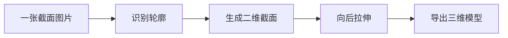
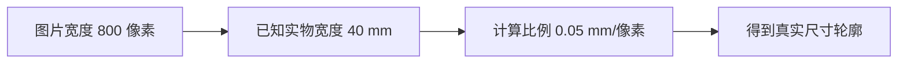
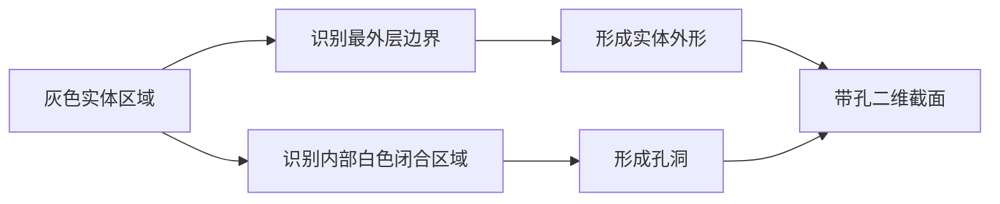
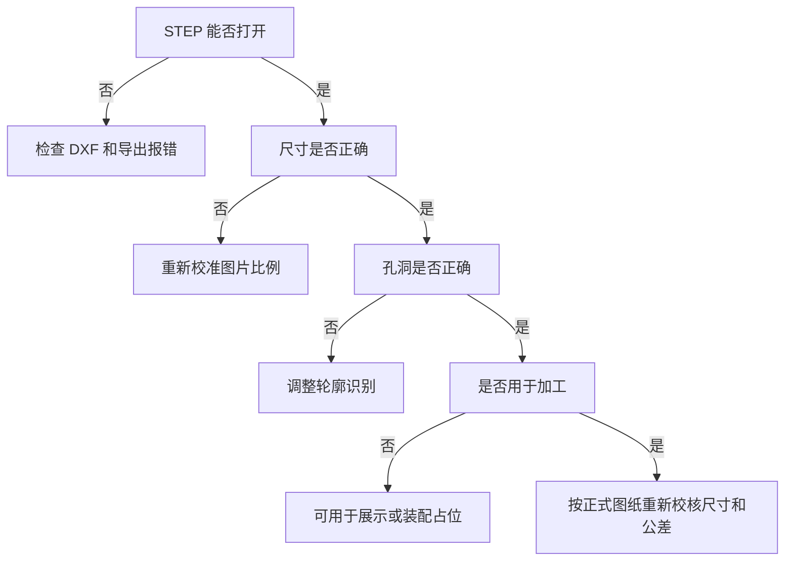
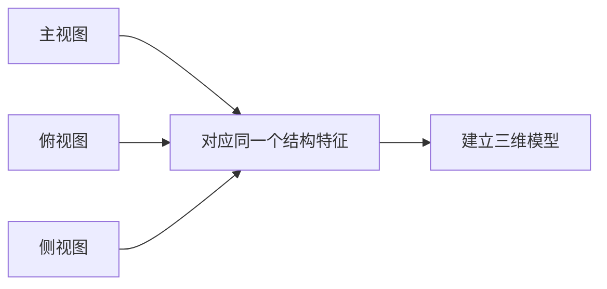
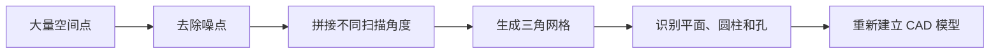
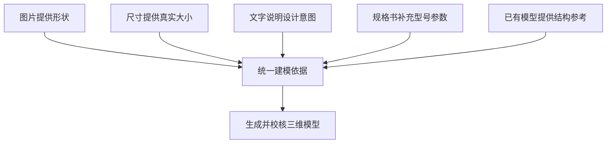

# 使用 AI 使图片转为三维模型


以前拿到一张型材截面图，如果想把它变成三维模型，通常需要打开 FreeCAD、SolidWorks 等软件，重新描一遍轮廓，再设置尺寸、处理孔洞、拉伸并导出文件。

对于熟悉 CAD 的工程师来说，这并不难，但仍然需要花时间。对于没有机械建模经验的人来说，仅仅是“草图、闭合轮廓、拉伸、STEP”这些词，就可能让人不知道从哪里开始。

现在可以换一种方式：

1. 把截面图片放进项目文件夹；
2. 告诉 AI 图片代表什么、真实尺寸是多少；
3. 让 AI 编写图片处理和三维建模代码；
4. 运行代码；
5. 得到可以在 FreeCAD 或 SolidWorks 中打开的 STEP 文件。

本文以一张 **4040-3.2 型材截面图片**为例，完整说明这个过程。

> 简单理解：AI 不是直接在聊天框里“变出”一个三维文件，而是帮助我们编写并运行一套自动建模程序。

## 1、做了什么事情，概况

### 1.1 最终得到了什么

本次使用的输入文件是：

```text
图片.png
```

程序运行后生成两个主要文件：

```text
profile_trace.dxf       二维截面轮廓
euro_4040_3p2.step      三维模型
```

整个过程可以简单理解为：



如果把它想象成做饼干：

- 截面图片相当于饼干模具的形状；
- DXF 相当于把模具边缘准确画出来；
- 拉伸相当于给这个平面形状增加厚度或长度；
- STEP 就是最终得到的三维零件文件。


*图 1：从原始截面图中识别外轮廓和孔洞，并转成可供 CAD 使用的闭合线框。*

### 1.2 先认识几个不熟悉的词

初学者不需要一开始就掌握复杂 CAD 原理，只需要先理解下面几个词。

| 名称 | 通俗解释 |
| --- | --- |
| 截面 | 把零件垂直切开后看到的形状 |
| 轮廓 | 截面的边界线，包括外边界和内部孔洞 |
| DXF | 常见的二维 CAD 图形文件，可以保存线和轮廓 |
| 拉伸 | 把一个二维形状沿某个方向延长，变成三维实体 |
| STEP | 通用三维模型文件，多数机械 CAD 软件都能打开 |
| CadQuery | 用 Python 代码建立三维模型的工具 |
| 参数化 | 修改一个数字，例如长度，就能自动得到新模型 |

例如，一个 40 mm × 40 mm 的方形截面，向后拉伸 100 mm，就会得到一根长 100 mm 的方形型材。

### 1.3 为什么选择这个例子

4040 型材比较适合用来理解 AI 建模，因为它有三个特点：

- 截面形状相对清晰；
- 沿长度方向的结构不变；
- 只需要把截面向后拉伸，就能得到完整三维模型。

这类零件通常包括：

- 铝型材；
- 导轨；
- 密封条；
- 管材；
- 线槽；
- 长条形支撑件。

如果零件前后结构不同，或者包含复杂曲面，就不能只用一次拉伸完成，后面还会专门说明。

### 1.4 本次使用了哪些工具

| 工具 | 用来做什么 | 初学者需要掌握多少 |
| --- | --- | --- |
| AI 编程工具 | 根据要求编写代码、解释报错、修改程序 | 会用自然语言描述需求即可 |
| Python | 运行图片处理和建模脚本 | 前期只需要会运行文件 |
| CadQuery | 把二维截面拉伸为三维实体 | 不需要先系统学习 |
| OCP CAD Viewer | 在 VS Code 中预览三维模型 | 会旋转、缩放即可 |
| FreeCAD | 打开 STEP、测量尺寸、继续修改 | 会打开文件和测量即可 |

这一方案不是要求产品经理或普通用户先成为机械工程师，而是先借助 AI 跑通流程，再逐步理解关键环节。

### 1.5 完整操作流程

下面先给出全流程，后面再逐步解释。

```text
准备截面图片
    ↓
告诉 AI 已知尺寸和拉伸长度
    ↓
AI 编写轮廓识别脚本
    ↓
生成 profile_trace.dxf
    ↓
CadQuery 导入 DXF
    ↓
把截面拉伸 100 mm
    ↓
在 VS Code 中预览
    ↓
导出 euro_4040_3p2.step
    ↓
在 FreeCAD 中检查尺寸
```

这条流程中真正需要人工做的事情主要有三项：

1. 提供清晰图片和真实尺寸；
2. 检查 AI 是否正确识别轮廓；
3. 检查最终模型是否符合使用目的。

## 2、准备工作

### 2.1 准备一张合适的图片

不是任何图片都适合直接生成三维模型。

#### 推荐使用的图片

- 正对截面拍摄或截取；
- 轮廓完整，没有被文字遮挡；
- 实体和背景颜色差异明显；
- 图片没有明显倾斜和透视；
- 至少知道一个真实尺寸；
- 分辨率足够看清小孔和槽口。

#### 不太适合的图片

- 从侧上方拍摄，截面已经变形；
- 图片过小或严重模糊；
- 轮廓被尺寸线、箭头和文字覆盖；
- 只展示局部，没有完整外边界；
- 不知道任何真实尺寸；
- 零件表面反光，边界无法分辨。

#### 为什么一定要有真实尺寸

电脑看到的图片单位是像素，而机械模型通常使用毫米。

假设图片中的型材宽度为 800 像素，实际宽度为 40 mm，则：

```text
40 mm ÷ 800 px = 0.05 mm/px
```

程序就可以按照这个比例，把图片中的每个像素换算成毫米。



如果没有这个尺寸，AI 可以恢复大致形状，但不知道模型究竟应该是 40 mm、80 mm 还是 400 mm。

### 2.2 准备一份清晰的建模要求

开始操作前，先准备好以下信息：

- 原始截面图片 `图片.png`；
- 至少一个真实尺寸，本例为 40 mm × 40 mm；
- 需要生成的模型长度，本例为 100 mm；
- 实体和孔洞的判定规则，本例为灰色是实体、白色是孔洞；
- 期望输出格式，本例为 DXF 和 STEP；
- 可以运行 Python 的电脑；
- 用于预览和检查模型的 VS Code、OCP CAD Viewer 或 FreeCAD。

还需要提前明确模型的用途：是用于外观展示、装配占位，还是准备进一步完善为加工模型。用途不同，后续检查的严格程度也不同。

## 3、具体使用步骤

### 3.1 把需求告诉 AI

需求描述得越清楚，AI 越不容易自行猜测。

不推荐只说：

```text
帮我把这张图片变成三维模型。
```

建议这样写：

```text
请根据项目目录中的 图片.png，生成一个三维型材模型。

已知条件：
1. 图片是型材的正视截面图；
2. 型材实际外形尺寸为 40 mm × 40 mm；
3. 灰色区域是实体；
4. 白色闭合区域是孔洞；
5. 截面沿长度方向保持不变；
6. 需要生成 100 mm 长的模型。

实现要求：
1. 使用 Python 识别图片中的实体轮廓；
2. 区分外轮廓和内部孔洞；
3. 按 40 mm × 40 mm 校准比例；
4. 输出 profile_trace.dxf；
5. 使用 CadQuery 拉伸 100 mm；
6. 在 OCP CAD Viewer 中预览；
7. 导出 euro_4040_3p2.step；
8. 检查 STEP 是否为有效实体；
9. 不要自行增加图片中不存在的结构。
```

这段要求实际上告诉了 AI 五类信息：

| 信息 | 本例内容 |
| --- | --- |
| 输入是什么 | 一张正视截面图片 |
| 哪部分是实体 | 灰色区域 |
| 真实尺寸是多少 | 40 mm × 40 mm |
| 三维长度是多少 | 100 mm |
| 最终要什么文件 | DXF 和 STEP |

### 3.2 AI 从图片中识别轮廓

图片处理脚本会做以下事情：

1. 打开 `图片.png`；
2. 找到代表型材的灰色区域；
3. 沿灰色区域边缘寻找边界；
4. 找到最外侧轮廓；
5. 找到内部白色孔洞；
6. 删除太小的噪点；
7. 按真实尺寸缩放；
8. 保存成 DXF。

#### 外轮廓和孔洞有什么区别

可以把型材想象成一个带孔的饼干：

- 最外侧边缘决定饼干的整体形状；
- 中间的白色区域是被挖掉的部分；
- 如果只识别外边缘，最终会变成实心方柱；
- 如果孔洞识别错误，内部结构就会不正确。



本例代码中有这样一行：

```python
import trace_profile
```

`trace_profile.py` 就是负责读取图片并生成二维轮廓的脚本。

### 3.3 生成二维 DXF

图片是由许多像素组成的，CadQuery 不能直接把一张普通 PNG 图片当成机械截面拉伸。

所以需要先把像素边缘变成真正的线条和闭合轮廓，并保存为：

```text
profile_trace.dxf
```

DXF 在这里相当于中间文件：

```text
PNG 图片 → DXF 二维轮廓 → STEP 三维模型
```

一个能够正常拉伸的 DXF，需要满足：

- 外边界是闭合的；
- 每个孔洞也是闭合的；
- 没有多余尺寸线和文字；
- 没有断开的线段；
- 没有互相交叉的错误线条；
- 单位和尺寸正确。

如果轮廓没有闭合，可以把它想象成杯底有一条裂缝，软件无法判断哪里是“内部”，自然也就无法生成完整实体。


*图 2：DXF 保存的是二维线框。外轮廓和每个内部孔洞都必须闭合，才能顺利生成实体。*

### 3.4 把二维截面拉伸成三维模型

生成 DXF 后，使用 CadQuery 完成拉伸。

完整代码如下：

```python
"""从 图片.png 提取的 4040-3.2 截面拉伸模型。"""

import cadquery as cq
from ocp_vscode import show
import trace_profile  # 运行时从图片刷新 DXF

LENGTH = 100.0

# 导入二维截面
section = cq.importers.importDXF("profile_trace.dxf")

# 把二维截面沿长度方向拉伸
part = section.wires().toPending().extrude(LENGTH)

# 在 VS Code 中显示三维模型
show(part)

# 导出 STEP 文件
cq.exporters.export(part, "euro_4040_3p2.step")

print("已导出: euro_4040_3p2.step")
```

初学者不需要一次看懂所有代码，先抓住以下三行即可。

#### 设置模型长度

```python
LENGTH = 100.0
```

表示型材长度为 100 mm。

如果需要 500 mm 长的模型，可以改成：

```python
LENGTH = 500.0
```

#### 导入二维截面

```python
section = cq.importers.importDXF("profile_trace.dxf")
```

意思是让 CadQuery 打开刚才生成的二维轮廓。

#### 拉伸并导出

```python
part = section.wires().toPending().extrude(LENGTH)
cq.exporters.export(part, "euro_4040_3p2.step")
```

第一行把二维轮廓拉伸成三维实体，第二行把实体保存成 STEP 文件。


*图 3：拉伸就是让二维截面沿一个方向延长。截面中的孔洞也会沿整个长度贯通。*

### 3.5 安装和运行

#### 需要准备的软件

- Python；
- VS Code；
- CadQuery；
- OCP CAD Viewer；
- FreeCAD，用来打开和检查 STEP。

#### 推荐文件夹结构

```text
ai-cad-model/
├── 图片.png
├── trace_profile.py
├── build_profile.py
├── profile_trace.dxf
└── euro_4040_3p2.step
```

其中：

- `图片.png` 是原始输入；
- `trace_profile.py` 负责识别图片；
- `build_profile.py` 负责拉伸并导出；
- 后两个文件由程序生成。

#### 创建 Python 环境

在项目目录打开终端：

```bash
python -m venv .venv
```

Windows PowerShell 中激活：

```powershell
.\.venv\Scripts\Activate.ps1
```

安装主要工具：

```bash
pip install cadquery ocp-vscode opencv-python ezdxf numpy
```

运行建模脚本：

```bash
python build_profile.py
```

如果成功，会看到：

```text
已导出: euro_4040_3p2.step
```

### 3.6 在 FreeCAD 中检查模型

生成文件不等于工作结束。

打开 FreeCAD，选择：

```text
文件 → 打开 → euro_4040_3p2.step
```

至少检查以下内容：

#### 检查一：能否正常打开

如果打不开，可能是模型导出失败，或者模型几何无效。

#### 检查二：整体尺寸

确认：

- 截面宽度是否为 40 mm；
- 截面高度是否为 40 mm；
- 长度是否为 100 mm。

#### 检查三：内部孔洞

从端面观察，确认孔洞数量、位置和大致形状与原图一致。

#### 检查四：是否为实体

模型需要是一个封闭实体，而不是只有外表面或一些线条。

#### 检查五：是否符合实际用途

如果只是放进装配图中观察占用空间，外形和安装位置正确通常就够了。

如果要做加工图，则需要进一步确认壁厚、圆角、槽口、孔径和公差。


*图 4：STEP 导出后仍需在 CAD 软件中检查整体尺寸、孔洞、实体状态和安装接口。*



## 4、其他

### 4.1 图片生成的模型到底准不准

这取决于原始图片。

如果图片清晰、没有透视，并且提供了准确的尺寸基准，模型的外形可以比较接近原件。

但图片仍然可能带来以下误差：

| 原因 | 会产生什么问题 |
| --- | --- |
| 图片分辨率不高 | 小孔、细槽和圆角不准确 |
| 图片被缩放变形 | 宽度和高度比例不正确 |
| 拍摄角度倾斜 | 截面变成梯形或椭圆 |
| 阴影和反光 | 程序把阴影误认为结构 |
| 只有一个尺寸 | 局部壁厚和孔径仍可能不准确 |
| 原图没有隐藏结构 | AI 无法恢复看不到的部分 |

因此，模型可以分为三个层级。

#### 第一层：外观模型

看起来相似，适合展示、PPT、动画和概念说明。

#### 第二层：装配占位模型

总尺寸和安装接口经过检查，可以用于观察空间、安装位置和大致干涉。

#### 第三层：加工模型

所有关键尺寸、孔位、壁厚、材料、公差和工艺都经过工程确认，才能用于加工。

> 仅根据一张图片生成的模型，默认应该按外观模型或装配占位模型使用，不能直接当作加工图。

### 4.2 除了截面图片，还能提供什么输入

可以。实际建模时，输入资料越完整，AI 越不需要猜测。

下面按照“最容易理解、最常见”到“更专业”的顺序介绍。

#### 输入一：文字和尺寸

如果零件由简单的长方体、圆柱、孔和槽组成，可以不提供图片，直接用文字描述。

例如：

```text
生成一块铝合金安装板：

- 长 120 mm；
- 宽 80 mm；
- 厚 6 mm；
- 四角各有一个直径 6.5 mm 的通孔；
- 每个孔的中心距离相邻两条边都是 10 mm；
- 中心有一个 50 mm × 30 mm 的矩形孔；
- 矩形孔四角圆角为 R3；
- 导出 STEP 文件。
```

这种方式适合：

- 安装板；
- 支架；
- 垫片；
- 法兰；
- 简单盒体；
- 带规则孔阵列的零件。

需要注意，文字必须说清楚尺寸从哪里量。例如“孔距离边缘 10 mm”可能有两种理解：孔中心到边缘 10 mm，或孔的外边到边缘 10 mm。

推荐写成：

```text
孔中心距离左边缘 10 mm，距离上边缘 10 mm。
```

#### 输入二：手绘草图

可以在纸上画出零件的大致形状，再标出关键尺寸，然后拍照交给 AI。

手绘草图不需要非常漂亮，但最好做到：

- 线条清楚；
- 不同方向的视图分开画；
- 每个尺寸有明确箭头；
- 孔径写成“Ø6”；
- 圆角写成“R3”；
- 标明单位；
- 标出哪些孔是通孔、哪些是盲孔。

手绘草图比单纯文字更直观，文字又可以补充草图中不容易表达的结构。两者一起提供通常更可靠。

#### 输入三：带尺寸的二维工程图

如果已经有主视图、俯视图和侧视图，AI 可以根据不同方向的投影关系建立三维模型。



工程图通常比普通照片可靠，因为它包含真实尺寸。

AI 可以帮助提取：

- 长、宽、高；
- 孔径和孔距；
- 台阶和槽口；
- 圆角和倒角；
- 剖面结构；
- 尺寸公差。

不过，如果图纸有尺寸缺失或互相矛盾，应该先让 AI 列出问题，不要让它自行补全。

推荐先提这样的要求：

```text
请先读取工程图，不要立即建模。

先列出：
1. 图中所有尺寸；
2. 可以确认的结构；
3. 缺失的尺寸；
4. 互相矛盾的标注；
5. 需要我确认的问题。

确认完成后再生成三维模型。
```

#### 输入四：PDF 规格书

供应商通常会提供 PDF 产品手册，其中可能包含：

- 截面图；
- 安装图；
- 尺寸表；
- 不同型号；
- 材料和重量；
- 安装孔位置。

AI 可以先从 PDF 中找到相关型号和图纸页面，再读取尺寸并建模。

需要特别注意：

- PDF 里可能有多个相近型号；
- 扫描 PDF 的数字可能识别错误；
- `8` 可能被识别成 `3`；
- 小数点、直径符号 `Ø` 可能被漏掉；
- 图片比例不能直接代替正式标注尺寸。

因此最好让 AI 同时输出“尺寸来源”，例如某个尺寸来自第几页、哪个表格或哪张图。

#### 输入五：DXF、DWG 或 SVG 文件

如果供应商已经提供二维 CAD 文件，应优先使用它，而不是截图后重新识别。

原因很简单：

- 截图是像素图片，放大会出现锯齿；
- DXF、DWG 和 SVG 本身就是线条；
- 使用原始线条可以减少描边误差。

处理流程通常是：

```text
打开二维文件
    ↓
确认单位
    ↓
删除尺寸线、文字和中心线
    ↓
检查轮廓是否闭合
    ↓
拉伸或旋转
    ↓
导出 STEP
```

其中 DWG 可能需要先转换为 DXF，SVG 也需要确认单位是像素还是毫米。

#### 输入六：Excel 或 CSV 尺寸表

如果多个零件形状相同，只是尺寸不同，可以把所有型号放进一个表格。

例如：

| 型号 | 宽度/mm | 高度/mm | 长度/mm | 中心孔/mm |
| --- | ---: | ---: | ---: | ---: |
| A01 | 20 | 20 | 100 | 5 |
| A02 | 30 | 30 | 200 | 8 |
| A03 | 40 | 40 | 300 | 10 |

AI 可以编写一个脚本，自动逐行读取表格并生成：

```text
A01_20x20_L100.step
A02_30x30_L200.step
A03_40x40_L300.step
```

这种方式非常适合：

- 不同长度的型材；
- 系列化安装板；
- 多种规格的垫片；
- 标准零件库；
- 同一产品的多个尺寸版本。

#### 输入七：多角度照片或视频

如果零件不是等截面结构，单张图片无法展示背面和深度，可以从多个角度拍摄。

建议至少提供：

- 正面；
- 背面；
- 左侧；
- 右侧；
- 顶部；
- 底部；
- 带标尺的局部照片。

这些照片可以作为建模参考，也可以交给摄影测量软件生成点云和网格。

简单理解：摄影测量就是通过同一个结构在不同照片中的位置变化，反推出它在三维空间中的位置。

```text
多角度照片或视频
    ↓
找出相同特征点
    ↓
计算每张照片的拍摄位置
    ↓
恢复三维点
    ↓
生成表面网格
```

需要注意，这类方法更容易得到类似 3D 扫描的网格模型，不一定能直接得到带有精确尺寸和可编辑特征的机械 CAD 模型。

#### 输入八：点云或三维扫描文件

专业三维扫描设备可以直接采集物体表面的大量三维坐标，这些坐标组成“点云”。

可以把点云理解为：物体表面布满了成千上万个空间点，但这些点之间暂时还没有连成完整表面。



点云适合复杂实物逆向，但“点云转 STEP”并不是简单修改文件后缀。

STEP 需要完整的实体和曲面关系，因此通常还要识别：

- 哪些区域是平面；
- 哪些区域是圆柱；
- 哪些结构是孔；
- 哪些边缘是圆角；
- 哪些部分应该对称。

#### 输入九：已有 STL、OBJ 或 STEP 文件

如果已经有三维文件，应优先从原文件继续处理。

##### STL 和 OBJ

这两种文件通常由许多小三角形组成，适合：

- 3D 打印；
- 外观展示；
- 扫描模型；
- 动画和渲染。

但它们通常没有尺寸参数和建模步骤，修改孔径、壁厚和圆角并不方便。

##### STEP 和 IGES

这类文件更适合机械 CAD 软件使用，通常能保存实体或曲面信息。

AI 可以帮助：

- 修改长度；
- 增加或删除孔；
- 批量转换格式；
- 检查包围盒尺寸；
- 从装配体中提取零件；
- 按规则批量重命名。

如果有 SolidWorks、Creo、Inventor 或 FreeCAD 的原生文件，修改设计通常会更加方便，因为原生文件可能保留草图、尺寸和建模步骤。

### 4.3 最可靠的方法：组合多种输入

实际工作中，最好不要只提供一种资料。

以 4040-3.2 型材为例，可以一起提供：

- 截面图片，用来说明复杂形状；
- 外形尺寸 40 mm × 40 mm，用来校准比例；
- 壁厚 3.2 mm，用来检查主要结构；
- 长度 100 mm，用来完成拉伸；
- PDF 规格书，用来确认槽口和孔径；
- 相近型号 STEP，用来确认安装方向。



图片、尺寸、文字和原始文件互相验证，AI 自行猜测的空间就会明显减少。

### 4.4 不同输入应该选择哪种方法

| 手里有什么 | 推荐做法 |
| --- | --- |
| 清晰截面图片和一个尺寸 | 识别轮廓、生成 DXF、拉伸 |
| 简单零件的明确尺寸 | 直接用文字生成参数化模型 |
| 手绘草图和尺寸 | 先提取尺寸，再确认结构并建模 |
| 完整三视图 | 按视图关系建立参数化模型 |
| PDF 规格书 | 先确定型号和尺寸来源，再建模 |
| DXF 或 DWG | 清理原始轮廓后直接拉伸 |
| Excel 系列参数 | 编写脚本批量生成多个型号 |
| 多角度照片或视频 | 摄影测量或照片辅助人工重建 |
| 点云或扫描网格 | 去噪、表面重建、逆向建模 |
| 已有 STEP | 在原有几何基础上修改或修复 |

### 4.5 建模前先让 AI 检查资料

无论提供什么输入，都建议先让 AI 做信息检查，不要立即建模。

可以直接使用下面这段提示词：

```text
请先检查我提供的全部建模资料，不要立即生成模型。

请告诉我：
1. 目前已经知道哪些尺寸；
2. 可以确认哪些结构；
3. 哪些位置在图片或图纸中看不到；
4. 还缺少哪些关键尺寸；
5. 不同资料之间有没有冲突；
6. 推荐使用拉伸、旋转、扫掠还是其他方式；
7. 最终只能做外观模型、装配模型，还是可以做加工模型；
8. 建模前还需要我确认什么。

不要自行猜测没有提供的尺寸和隐藏结构。
```

这一步很重要，因为 AI 最常见的问题不是“不会写代码”，而是在资料不足时按照常见结构自行补全。

### 4.6 常见报错和解决思路

#### DXF 无法拉伸

可能原因：

- 轮廓没有闭合；
- 存在重复线段；
- 线段互相交叉；
- 有非常小的噪点；
- 外轮廓和孔洞关系识别错误。

可以告诉 AI：

```text
请检查 DXF 中每个轮廓是否闭合，删除重复线段和过短线段，检查自相交，并输出每个轮廓的面积和包围盒尺寸。
```

#### 拉伸后变成实心方柱

说明内部白色区域没有被识别为孔洞，需要检查图片处理脚本或 DXF 中内部轮廓是否闭合。

#### 模型尺寸不正确

依次检查：

1. 图片是否被横向或纵向拉伸；
2. 40 mm 对应的像素数是否正确；
3. DXF 使用的是毫米还是其他单位；
4. FreeCAD 导入时是否发生单位转换。

#### 模型边缘有很多锯齿

图片边缘本身由像素组成，直接转换后可能出现大量短线段。

程序可以进行轮廓简化，或把接近直线的区域拟合成直线，把接近圆的区域拟合成圆弧。

但简化不能过度，否则小孔和窄槽可能被删除。

#### STEP 可以打开，但无法正常修改

STEP 通常保存最终几何，不一定保留原始草图和完整建模步骤。

如果后续需要频繁调整尺寸，应该保留 CadQuery 脚本，或者在 FreeCAD、SolidWorks 中重新建立参数化特征。

### 4.7 哪些情况适合使用这套方法

比较适合：

- 快速制作装配占位模型；
- 根据供应商截面图建立型材模型；
- 生成不同长度的同类零件；
- 制作结构示意、PPT 和动画素材；
- 在方案阶段快速验证安装空间；
- 把规则零件沉淀为参数化模型库。

不太适合直接使用：

- 复杂曲面零件；
- 看不到背面和内部结构的单张照片；
- 需要严格公差配合的加工件；
- 图片严重倾斜或模糊；
- 准备直接用于开模或数控加工；
- 涉及复杂装配关系但资料不完整。

### 4.8 如何把一次操作变成长期工具

第一次使用时，可以让 AI 针对单个型材编写脚本。

如果后续经常需要生成类似模型，可以继续增加：

- 图片上传入口；
- 已知尺寸输入框；
- 轮廓识别预览；
- 手动删除错误轮廓；
- 拉伸长度输入框；
- DXF 闭合检查；
- STEP 有效实体检查；
- 批量型号生成；
- 尺寸和生成结果报告。


这样就可以把一次性的 AI 对话，逐步变成公司内部可重复使用的小工具。

### 4.9 数据和图纸安全

如果使用在线 AI 处理客户图纸、供应商结构或未发布产品，需要提前确认资料是否允许上传。

建议：

- 只上传建模所需的局部内容；
- 删除客户名称、项目名称和图签；
- 不要上传无关的完整装配图；
- 确认 AI 服务是否保留数据；
- 涉密资料使用内部环境或离线模型；
- 正式图纸仍然保存在受控 CAD 或 PDM 系统中。

### 4.10 小结

本文用 4040-3.2 型材说明了如何把一张截面图片转成三维模型：

```text
图片.png
    ↓
识别实体和孔洞
    ↓
profile_trace.dxf
    ↓
CadQuery 拉伸 100 mm
    ↓
euro_4040_3p2.step
```

这套方法最重要的不是某一段代码，而是建立了一条清晰的工作方式：

1. 用户提供图片、尺寸和使用目的；
2. AI 帮助完成重复性的识别和建模代码；
3. 人工检查尺寸、隐藏结构和工程合理性；
4. 确认后再把模型用于展示、装配或后续设计。

除了图片，还可以提供文字尺寸、手绘草图、工程图、PDF、DXF、Excel、多角度照片、视频、点云和已有 CAD 文件。

输入资料越完整，AI 猜测越少，最终模型越可靠。

更准确地说，AI 并不是替代机械工程师完成最终设计，而是把工作方式从“手工从零建模”，转变为“AI 生成初稿，人工审核和完善”。
