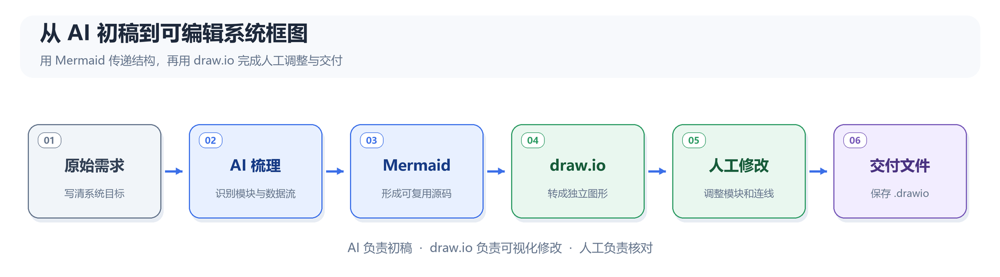
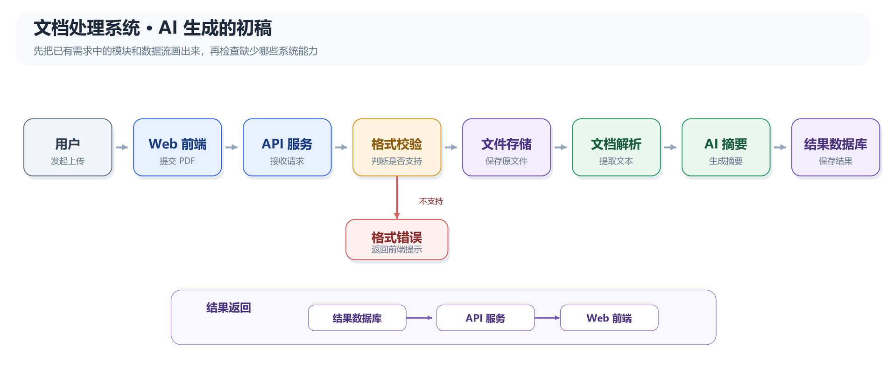
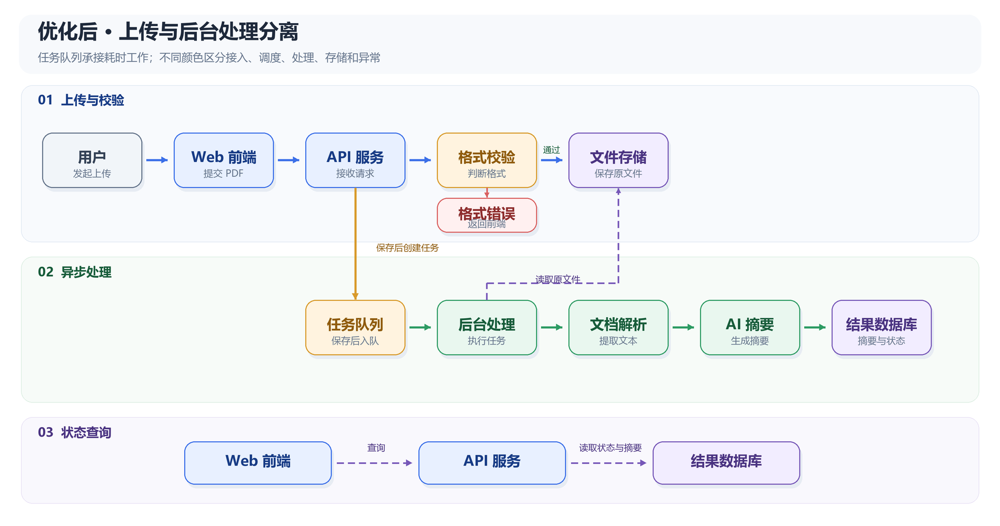

# AI 生成的系统流程框图怎么继续改？用 Mermaid 和 draw.io 做成可编辑图形

让 AI 根据一段需求说明画系统流程框图并不难。真正麻烦的，往往是图画完之后的修改。

例如，AI 已经画好一张文档处理系统的框图，同事看完提出三个要求：增加任务队列和后台处理模块，补充前端查询任务状态的路径，再调整几个模块的位置。如果手里只有一张成品图片，模块和连线无法单独修改；如果手里只有 Mermaid 代码，修改数据流又需要找到对应语句，理解箭头和节点的写法。

我希望保留 AI 快速生成初稿的效率，也让后续修改可以在画布上直接完成。这里用到的组合是 **AI + Mermaid + draw.io**：AI 负责梳理系统模块和数据流并生成 Mermaid，draw.io 把它变成可以点击、拖动和修改的图形。

> 本文的重点是把 AI 生成的系统框图交到人手里继续编辑。Mermaid 在其中承担结构描述和传递的工作。

整套工作可以先看成一条交接链路：



*图 1：AI 生成初稿，draw.io 承接后续人工编辑。*

## 这次要做什么

假设要为一个简单的文档处理系统画框图。系统需求如下：

> 用户从 Web 前端上传 PDF。API 服务检查文件格式；格式不支持时返回错误，格式合格时保存原文件。文档解析服务读取文件并提取文本，AI 服务生成摘要，结果保存到数据库。API 服务读取摘要并返回给前端展示。

最终希望得到两个文件：

```text
文档处理系统.mmd       AI 生成的 Mermaid 源码
文档处理系统.drawio    人工可以继续修改的系统框图
```

这段说明包含用户、前端、API、文件存储、处理服务和数据库，足以检验 AI 有没有把模块及其连接关系画对。后面还会模拟一次方案评审后的修改，看看能否直接在图上增加模块和数据流。

## 第一步：让 AI 生成 Mermaid 初稿

可以把系统需求直接交给 AI，同时说清楚输出要求：

```text
我要画一个系统流程框图。请把下面的系统需求整理成图。

先列出系统参与者、模块、数据流和异常路径，
指出需求中不明确的地方，再生成 Mermaid flowchart LR 代码。
不要自行增加需求中没有提到的服务和数据库。
节点文字尽量简短，连线标明传递的文件、请求或结果。

系统需求：
用户从 Web 前端上传 PDF。API 服务检查文件格式；格式不支持时返回错误，
格式合格时保存原文件。文档解析服务读取文件并提取文本，AI 服务生成摘要，
结果保存到数据库。API 服务读取摘要并返回给前端展示。
```

先让 AI 列出模块和数据流，是为了在画图之前检查结构。例如，前端不能直接读取数据库；查询结果要经过 API 服务。如果需求没有说明“解析失败时如何处理”，就应把它列为待确认问题，而不是替系统设计一套未经确认的重试机制。

确认流程后，可以得到下面的系统初稿。配图突出主要处理路径和格式错误分支：



*图 2：AI 根据原始需求生成的系统框图初稿。*

对应的 Mermaid 源码如下，包含结果经 API 返回前端的完整连接：

```text
flowchart LR
    U["用户"] -- "上传 PDF" --> FE["Web 前端"]
    FE -- "上传请求" --> API["API 服务"]
    API --> CHECK{"格式是否支持？"}
    CHECK -- "否" --> ERR["返回格式错误"]
    ERR --> FE
    CHECK -- "是" --> FILE["文件存储"]
    FILE -- "读取文件" --> PARSE["文档解析服务"]
    PARSE -- "文本" --> AI["AI 摘要服务"]
    AI -- "摘要" --> DB["结果数据库"]
    API -- "读取结果" --> DB
    DB -- "返回摘要" --> API
    API -- "展示结果" --> FE
```

这里不必先学完 Mermaid。只要能看出方括号表示模块、花括号表示判断、箭头表示数据或请求流向，就足够检查初稿。需要详细语法时，可以查阅 [Mermaid 流程图文档](https://mermaid.js.org/syntax/flowchart.html)。

把代码另存为 `文档处理系统.mmd`，后续即使要重新生成图，也有一份独立的结构源码。

## 第二步：在 draw.io 中生成可编辑图形

打开 draw.io，选择 **排列（Arrange）→ 插入（Insert）→ Mermaid**，粘贴上面的代码。导入时注意下方的选项：

| 选项 | 导入后的结果 | 适合的用途 |
| --- | --- | --- |
| Diagram（图形） | 转换成 draw.io 的节点和连线，可以分别选中并修改 | 后续需要人工编辑 |
| Image（图片） | 作为一张 SVG 图片插入，不能逐个编辑节点和连线 | 只需要固定外观的展示图 |

本例选择 **Diagram**。导入后，可以点击单个节点修改文字和颜色，也可以移动节点、调整连线路径。draw.io 会把 Mermaid 源码保存在生成的容器组里，仍可打开源码并重新生成图形。[draw.io 官方操作说明](https://www.drawio.com/docs/manual/mermaid/)

这一步就是整个方法的关键：AI 给出的系统结构，进入了普通人熟悉的可视化编辑界面。

## 第三步：像改普通流程图一样修改

现在模拟一次方案评审后的反馈：

> PDF 解析和 AI 摘要可能需要较长时间，上传请求不能一直等待处理完成。请增加任务队列和后台处理模块，并让前端能够查询任务状态。

这次修改涉及三个位置：API 在保存文件后创建后台任务并记录任务状态；后台处理模块从文件存储读取原文件，再调用解析与摘要服务；前端通过 API 查询任务状态。可以先把改动写成一张简表：

| 原图 | 修改后 |
| --- | --- |
| 文件存储直接连接文档解析服务 | 删除这条连线；增加“任务队列”和“后台处理模块” |
| 上传后直接等待摘要结果 | API 创建任务，记录状态，并先返回任务编号 |
| 前端等待处理完成后显示摘要 | 前端先查询任务状态，完成后再读取摘要 |

修改后的系统框图可以画成下面这样。实线表示主要处理路径，虚线表示读取文件或查询状态等辅助路径：



*图 3：增加任务队列和后台处理模块后的系统框图。颜色区分模块角色，虚线区分辅助数据流。*

以下 Mermaid 源码表达相同的模块和连接关系；自动排版的位置可能与配图不同：

```text
flowchart LR
    subgraph S1["接入层"]
        U["用户"]
        FE["Web 前端"]
    end
    subgraph S2["接口与调度"]
        API["API 服务"]
        CHECK{"格式支持？"}
        Q["任务队列"]
        ERR["返回格式错误"]
    end
    subgraph S3["后台处理"]
        WORK["后台处理模块"]
        PARSE["文档解析服务"]
        AI["AI 摘要服务"]
    end
    subgraph S4["数据存储"]
        FILE["文件存储"]
        DB["结果数据库"]
    end

    U --> FE
    FE -- "上传 PDF" --> API
    API --> CHECK
    CHECK -- "否" --> ERR
    ERR --> FE
    CHECK -- "是" --> FILE
    API -- "保存后创建任务" --> Q
    Q --> WORK
    WORK --> PARSE
    PARSE --> AI
    AI -- "保存摘要" --> DB
    WORK -. "读取原文件" .-> FILE
    WORK -. "更新状态" .-> DB
    FE -. "查询状态或摘要" .-> API
    API -. "读取结果" .-> DB

    classDef user fill:#F1F5F9,stroke:#64748B,color:#1F2937
    classDef entry fill:#E8F0FF,stroke:#3B6FE8,color:#173B85
    classDef queue fill:#FFF3DF,stroke:#D89A2B,color:#8F5B0D
    classDef process fill:#E9F7EF,stroke:#2D9B63,color:#175C3A
    classDef store fill:#F2EDFF,stroke:#7657B8,color:#4A3381
    classDef error fill:#FFF0F0,stroke:#D96060,color:#8E2D2D
    class U user
    class FE,API,CHECK entry
    class Q queue
    class WORK,PARSE,AI process
    class FILE,DB store
    class ERR error
```

图 3 展示修改后的目标结构。实际操作如果只在 draw.io 画布上完成，原来保存的 `.mmd` 文件不会自动同步，需要在需要时单独更新。

如果后续主要由同事在画布上维护，先保存 `.mmd` 源码，再对 Mermaid 容器组执行 **取消组合（Ungroup）**，让模块和连线作为普通 draw.io 图形独立编辑。取消组合会删除容器组中保存的 Mermaid 源码，但不会影响已经单独保存的 `.mmd` 文件。[draw.io 关于容器组的说明](https://www.drawio.com/docs/manual/mermaid/)

接着在 draw.io 画布上添加“任务队列”和“后台处理模块”两个方框，拖出新的连线，双击修改文字，再调整模块位置。还要补上后台处理模块读取原文件、更新任务状态，以及前端经 API 查询任务状态的连接。最后删掉原来“文件存储”直接通向“文档解析服务”的连线，避免新旧两种处理方式同时留在图上。

完成修改后，保存为 `文档处理系统.drawio`。把文件重新打开，试着改一个模块名称、移动一个方框，确认交付给别人后仍然能继续编辑。

## 第四步：把系统框图整理得更清楚

图 3 下方的 Mermaid 源码用 `subgraph` 把模块分成接入、接口与调度、后台处理、数据存储四组，并用 `classDef` 给不同角色统一配色。这两项都属于 Mermaid 流程图支持的写法。[Mermaid 流程图语法](https://mermaid.js.org/syntax/flowchart.html)

美化时先确定信息层次，再调整颜色和线条。本例可以采用一套克制的规则：

| 图形角色 | 建议颜色 | 表达的含义 |
| --- | --- | --- |
| 前端与 API | 蓝色 `#E8F0FF` | 用户请求的入口 |
| 任务队列 | 橙色 `#FFF3DF` | 等待处理的任务 |
| 后台处理模块 | 绿色 `#E9F7EF` | 实际执行的服务 |
| 文件与结果存储 | 紫色 `#F2EDFF` | 持久保存的数据 |
| 错误提示 | 浅红色 `#FFF0F0` | 异常路径 |

同一张图还可以按使用场景做两种外观：

| 方案 | 适合场景 | 调整方法 |
| --- | --- | --- |
| 工程文档版 | 技术方案、接口说明 | 保留分层、数据流标签和角色配色，方便逐条核对 |
| 汇报展示版 | PPT、项目评审 | 保留主处理路径的蓝绿两色，其余模块改浅灰；放大关键模块，减少次要连线标签 |

在 Mermaid 里，`classDef` 定义颜色，`class` 把同一类模块设成相同样式；图 3 的代码可以直接作为例子。颜色只是辅助识别，图中仍应保留“任务队列”“结果数据库”等明确名称，不能只靠颜色表达含义。

导入 draw.io 后，可以再做几项人工排版：

1. **让主路径朝一个方向走。**从用户、前端、API 到后台处理和存储，尽量保持从左到右；格式错误和状态查询放在主路径旁边。
2. **对齐并统一间距。**多选同一层的模块，在右侧格式面板的 **Arrange** 页使用 **Align** 和 **Distribute**，把方框排齐并拉开相同间隔。[draw.io 对齐与分布说明](https://www.drawio.com/docs/manual/shapes/arrange-align-shapes/)
3. **让形状承担固定含义。**普通服务用矩形，判断用菱形，存储模块可以在 draw.io 中换成数据库形状。同类模块保持相同大小和字体。
4. **让线条区分用途。**主要处理路径用实线；读取原文件、查询状态等辅助路径用虚线，并在必要的连线上写明传递内容。连线交叉较多时，在 draw.io 的样式面板调整连接路径。[draw.io 样式面板说明](https://www.drawio.com/docs/manual/styles/)
5. **控制文字长度。**方框里写模块名，动作放在线上；长句留在正文说明里。这样导出到 PPT 后，缩小图片仍能看清主要结构。

也可以让 AI 先帮忙整理 Mermaid 的外观，再交给 draw.io 微调：

```text
请在不改变模块和连接关系的前提下美化这段 Mermaid：
1. 用 subgraph 按接入、调度、处理、存储分组；
2. 用 classDef 统一同类模块的颜色；
3. 主处理路径用实线，辅助查询用虚线；
4. 缩短节点文字，避免不必要的交叉线；
5. 输出完整代码，并说明做了哪些视觉调整。
```

结构确定后再做细致排版比较省事。draw.io 允许修改导入节点的颜色、文字和线条；如果回头修改 Mermaid 源码并重新生成，手动调整的位置和连线路径会重新布局。[draw.io 的 Mermaid 编辑说明](https://www.drawio.com/docs/manual/mermaid/)

## 什么时候改画布，什么时候改 Mermaid

两种修改方式都可以保留，但适用的情况不同：

| 修改内容 | 建议方式 |
| --- | --- |
| 改几个字、颜色或节点位置 | 直接在 draw.io 画布上修改 |
| 增加少量模块或连线，交由同事继续维护 | 保存 `.mmd` 后，在 draw.io 中取消组合并修改 |
| 系统结构整体变化很大，需要重新安排大量连接 | 修改 Mermaid 源码，重新导入或生成 |

需要注意：如果在保留 Mermaid 容器组的情况下重新编辑源码并生成图，手动调整过的节点位置和连线路径会被重新布局。已经投入较多时间做人工排版时，先确定后续以画布还是源码为主要维护方式。[draw.io 官方说明](https://www.drawio.com/docs/manual/mermaid/)

## 交付前检查三件事

1. **系统关系正确。**前端通过 API 查询状态和结果；后台处理模块从文件存储读取原文件并更新状态；旧的直接处理连线已经删除。
2. **图形可编辑。**重新打开 `.drawio` 文件，确认模块、文字和连线能够单独修改。
3. **源码留存。**保存 `.mmd` 文件，方便以后根据新的需求重新生成框图。

最后可以按需要导出 PNG 或 SVG，用于文档和 PPT；日后要修改流程时，仍以 `.drawio` 文件为准。

## 小结

AI 很适合把需求说明迅速整理成系统框图初稿，但系统方案会经过评审，也会随着实际需求变化。Mermaid 让 AI 能用文字明确描述模块和数据流，draw.io 则把这些结果带进一个容易上手的可视化编辑界面。

这套方法可以用于文件处理系统、订单系统、数据同步链路、AI 应用架构等系统框图。下一次需要改图时，打开 `.drawio`，找到需要变动的模块和连线，直接继续修改。
