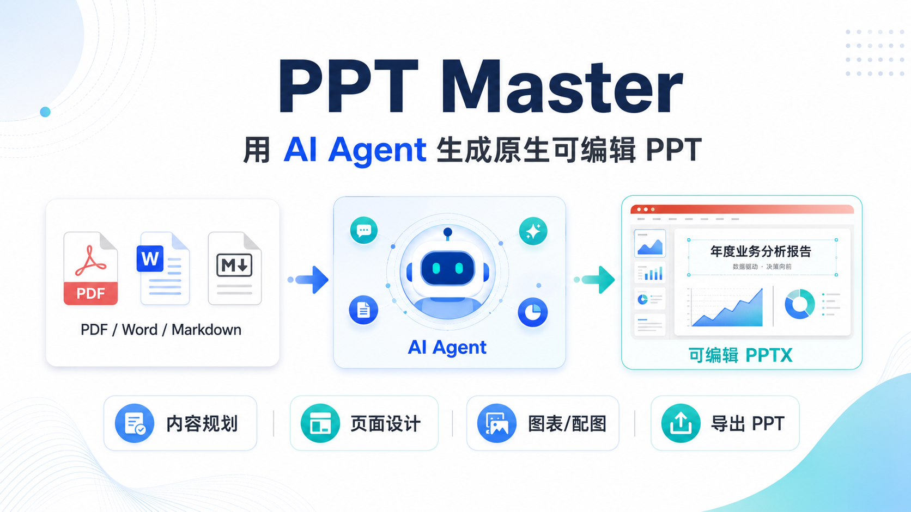
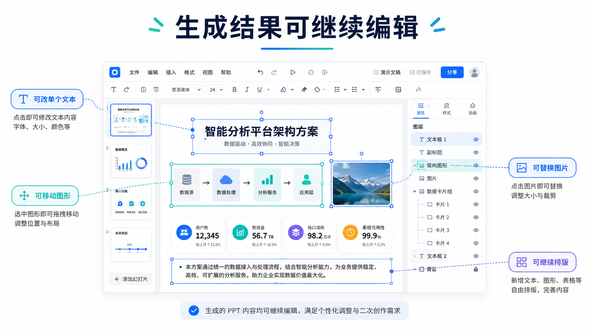
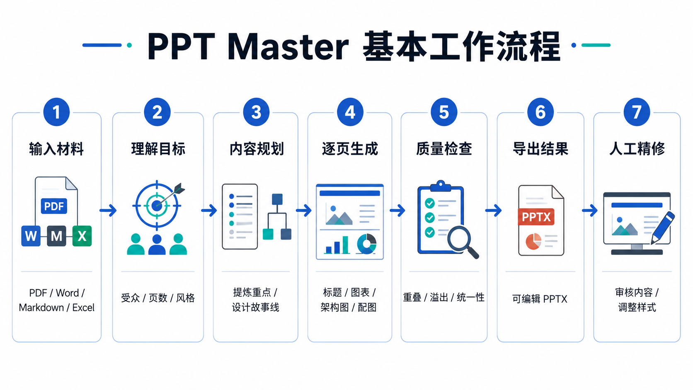
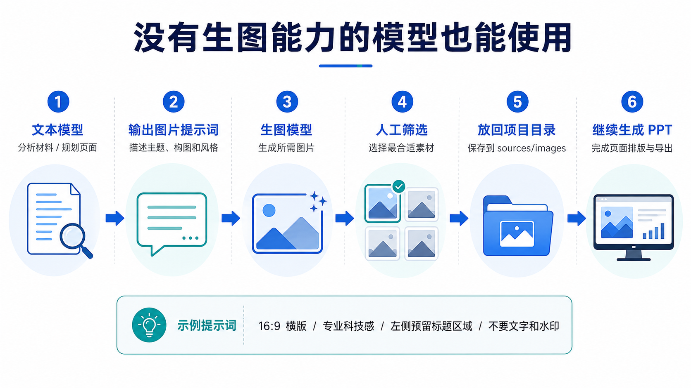
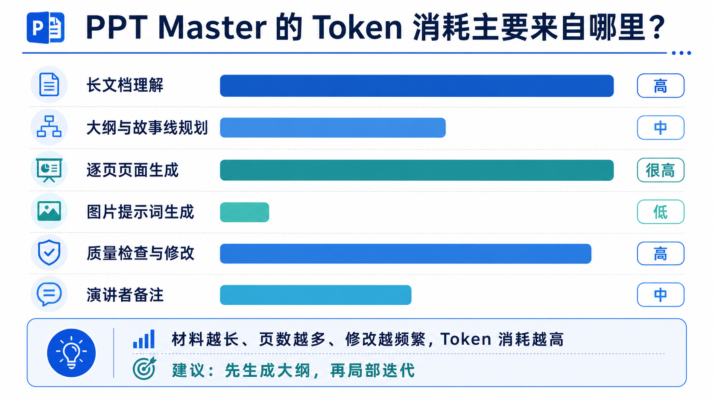

# 用 PPT Master 生成原生可编辑的 PPT



制作项目汇报、技术方案和培训材料时，真正耗费时间的往往不只是编写内容。

即使已经有完整的 Word、PDF 或 Markdown 文档，通常还需要重新提取重点、设计汇报结构、绘制流程图和架构图、寻找配图，并统一字体、颜色和页面布局。

目前已经有很多 AI PPT 工具，但实际使用中经常遇到两个问题：

1. 生成结果比较模板化，与具体业务内容结合不深；
2. 页面看起来完整，但导出后整页是一张图片，无法继续修改。

PPT Master 想解决的正是这些问题：让 AI 根据已有材料生成一套完整 PPT，并尽量保留文字、图形和页面元素的可编辑能力。

> PPT Master 不是传统的一键生成网站，而是一套运行在 AI Agent 中的 PPT 自动化工作流。

## PPT Master 是什么

PPT Master 是一个开源的 AI Agent 项目，可以配合 Claude Code、Cursor、Codex CLI 等具备文件读取、命令执行和代码生成能力的工具使用。

用户可以向 Agent 提供：

- PDF、Word 和 Markdown 文档；
- 网页内容；
- Excel 数据；
- 图片和其他项目资料。

然后通过自然语言描述 PPT 的用途、受众、页数和视觉风格。

例如：

```text
请根据 projects/project-review/sources/ 中的材料，
制作一份 10 页左右的项目阶段汇报 PPT。

汇报对象：公司管理层

重点内容：
1. 项目目标
2. 当前进度
3. 核心成果
4. 测试结果
5. 当前风险
6. 下一阶段计划

要求：
- 先结论后过程
- 风格简洁、专业
- 减少大段文字
- 优先使用流程图、架构图和数据图表
- 最终输出可编辑的 PPTX 文件
```

Agent 会根据项目定义的工作流，完成材料理解、内容规划、页面设计、视觉元素生成、质量检查和 PPTX 导出。

## 它和普通 AI PPT 工具有何不同

PPT Master 最值得关注的能力，不只是“可以生成 PPT”，而是最终结果能够继续在 PowerPoint 中修改。

| 方案 | 主要特点 | 常见局限 |
|---|---|---|
| 整页图片生成 | 页面视觉效果完整 | 文字和图形无法单独修改 |
| 固定模板填充 | 生成速度快、风格稳定 | 页面结构受模板限制 |
| HTML 演示 | 适合浏览器展示 | 导出 PPTX 后可能出现差异 |
| PPT Master | 生成原生文本和矢量元素 | 安装和使用门槛相对较高 |

通过 PPT Master 生成的页面，通常可以继续完成以下操作：

- 修改标题和正文；
- 调整字体、字号和颜色；
- 移动或缩放单个图形；
- 删除不需要的页面元素；
- 替换图片；
- 调整流程图和架构图；
- 在 PowerPoint 中继续排版。



这使它更适合进入正常的工作汇报流程，而不只是展示一次 AI 生成效果。

## 基本工作流程

PPT Master 的完整工作过程通常包括以下几个阶段：



它和普通对话式 AI 的区别在于，模型不只是输出一份大纲，而是需要连续完成多个步骤，并调用本地脚本生成最终文件。

典型流程可以概括为：

```text
读取原始材料
    ↓
理解汇报目标和受众
    ↓
提炼重点并设计故事线
    ↓
规划整套 PPT 页面结构
    ↓
逐页生成内容与视觉方案
    ↓
生成 SVG、图表和图片需求
    ↓
检查重叠、溢出和布局问题
    ↓
转换并导出 PPTX
    ↓
人工审核和最终修改
```

## 安装与准备

### 基础环境

一般需要准备：

- Python 3.10 或更高版本；
- Git；
- PPT Master 项目代码；
- 一个具备 Agent 能力的 AI 工具；
- 可以正常调用的大语言模型。

可以通过 Git 下载项目：

```bash
git clone https://github.com/hugohe3/ppt-master.git
cd ppt-master
pip install -r requirements.txt
```

也可以直接下载项目 ZIP，再按照项目文档安装依赖。

对于普通用户来说，这个过程会比网页式 AI PPT 工具复杂一些。PPT Master 目前更适合已经在使用 Cursor、Claude Code 或其他 AI 编程工具的用户。

### 在 Agent 中打开项目

如果使用 Cursor，可以直接打开 PPT Master 项目目录。

如果使用命令行 Agent，可以先进入项目目录，再启动对应工具：

```bash
cd ppt-master
claude
```

Agent 需要能够访问项目中的 Skill 文件、脚本和素材目录，才能执行完整生成流程。

## 准备输入材料

建议为每个 PPT 任务创建单独目录：

```text
projects/
└── project-review/
    └── sources/
        ├── 项目阶段总结.docx
        ├── 系统架构.png
        ├── 测试数据.xlsx
        └── 风险清单.md
```

输入材料并不是越多越好。

如果把大量无关资料全部交给模型，不仅会增加 Token 消耗，也可能影响模型对重点内容的判断。

在正式生成前，可以简单整理材料：

- 删除与本次汇报无关的文件；
- 标记必须展示的结论；
- 确认数据口径和单位；
- 给图片和表格补充必要说明；
- 明确哪些内容不能遗漏；
- 对敏感内容进行脱敏。

## 编写生成要求

生成要求越明确，最终结果通常越稳定。建议至少说明以下信息：

| 信息 | 示例 |
|---|---|
| 使用场景 | 项目阶段汇报 |
| 汇报对象 | 公司管理层 |
| 汇报目标 | 说明当前进度、风险和资源需求 |
| PPT 页数 | 10～12 页 |
| 页面比例 | 16:9 |
| 视觉风格 | 简洁、专业、科技感 |
| 必须内容 | 进度、成果、测试数据、风险、计划 |
| 表达要求 | 先结论后过程、减少大段文字 |
| 输出要求 | 可编辑 PPTX、需要演讲者备注 |

一个相对完整的 Prompt 可以写成：

```text
请使用 projects/project-review/sources/ 下的材料，
制作一份项目阶段汇报 PPT。

汇报对象：公司管理层
页数：10～12 页
比例：16:9

内容重点：
1. 项目背景和目标
2. 当前整体进度
3. 已完成工作
4. 核心测试结果
5. 当前问题和风险
6. 需要协调的事项
7. 下一阶段计划

视觉要求：
- 简洁、专业
- 每页只表达一个核心观点
- 页面标题尽量使用结论型表达
- 优先使用流程图、架构图和数据图表
- 避免大段文字
- 保持整套 PPT 风格统一

输出要求：
- 生成可编辑的 PPTX 文件
- 为每页生成演讲者备注
```

相比一句“帮我生成一份 PPT”，这种方式能够减少模型自由发挥带来的偏差。

## 生成过程中的调整

正式执行后，Agent 通常会先分析输入材料，再规划整套 PPT。

在这个阶段，可以重点关注它是否正确理解了：

- 汇报对象是谁；
- 整套 PPT 要解决什么问题；
- 哪些内容是主要结论；
- 哪些技术细节可以省略；
- 哪些数据必须重点展示；
- 页面结构是否符合实际汇报习惯。

如果整体大纲已经偏离目标，最好在生成全部页面之前及时调整。例如：

```text
当前大纲技术细节较多，请重新调整：

1. 第一页之后直接展示项目整体状态；
2. 将底层算法内容压缩为一页；
3. 增加一页当前风险和资源需求；
4. 最后一页明确下一阶段里程碑。
```

相比全部页面生成后再返工，在大纲阶段调整通常更节省时间和 Token。

## 没有图像生成能力的模型也可以使用

图像生成能力并不是使用 PPT Master 的必要条件。

即使当前模型只能处理文本和代码，它仍然可以完成：

- 材料分析；
- PPT 大纲设计；
- 页面结构规划；
- 流程图和架构图生成；
- SVG 页面生成；
- 图片需求分析；
- 图片提示词编写；
- PPTX 文件导出。

当页面需要图片时，可以让当前模型输出完整的图片生成提示词，再把提示词交给具备生图能力的模型。



例如：

```text
请为“系统整体方案”页面生成一段图片提示词。

图片将用于企业技术汇报 PPT。

画面主题：
远距离无人机探测系统。

核心元素：
光电转台、激光发射设备、单光子探测器和远处飞行的无人机。

视觉风格：
专业、克制、写实，具有适度科技感。

构图要求：
16:9 横版，主要设备位于画面右侧，
左侧保留标题和说明文字区域。

限制：
不要出现文字、Logo、水印和夸张科幻元素。
```

生成图片后，把图片放回项目素材目录：

```text
projects/
└── project-review/
    └── sources/
        └── images/
            └── system-overview.png
```

然后继续告诉 Agent：

```text
图片已经生成并保存为：

projects/project-review/sources/images/system-overview.png

请将这张图片用于系统整体方案页面，并继续完成 PPT。
```

这种方式虽然增加了一次手动操作，但也有一些优势：

- 可以分别选择更擅长文本和图像的模型；
- 可以使用专门的图像生成工具；
- 用户可以人工筛选生成图片；
- 图片不满意时不需要重新生成整套 PPT；
- 可以使用公司已经批准的图像生成服务。

用于 PPT 的图片提示词，不能只描述“画什么”，还要说明“怎么排版”。建议明确图片比例、主体位置、文字预留区域、视觉风格，以及是否允许出现文字、人物和 Logo。

## 生成效果较好，但 Token 消耗较大

PPT Master 的生成效果通常比较完整，但相应的 Token 消耗也比较大。



原因是它并不是只让模型输出一份 PPT 文案，而是需要模型连续完成：

- 阅读和理解长文档；
- 总结和提炼内容；
- 设计整套故事线；
- 规划每一页的布局；
- 生成 SVG 或其他页面代码；
- 编写图片提示词；
- 检查文字溢出和元素重叠；
- 根据检查结果修改页面；
- 生成演讲者备注。

其中，长材料分析、逐页页面生成和多轮修改，都会明显增加上下文和输出 Token。

Token 消耗通常会受到以下因素影响：

| 因素 | 对消耗的影响 |
|---|---|
| 输入材料长度 | 材料越多，阅读和理解成本越高 |
| PPT 页数 | 页面越多，输出内容越多 |
| 页面复杂度 | 架构图、流程图和复杂视觉页消耗更高 |
| 修改次数 | 多轮返工会重复消耗 Token |
| 检查轮次 | 自动检查越充分，调用次数越多 |
| 演讲者备注 | 每页需要额外生成说明 |
| 模型选择 | 不同模型的价格和上下文成本不同 |

因此，PPT Master 不一定适合所有任务。

对于三到五页的简单内部材料，直接使用现有模板可能更快。对于正式项目汇报、技术方案、培训课件或重要客户材料，它较高的生成成本才更容易体现价值。

## 如何减少 Token 消耗

### 减少无关材料

只提供和本次 PPT 相关的内容，不要把整个项目资料目录全部交给模型。

### 先生成大纲

先让 Agent 输出 PPT 大纲，确认无误后再逐页生成：

```text
请先阅读材料并输出 10 页 PPT 大纲。

暂时不要生成页面文件。
每页需要包含：
- 页面标题
- 核心结论
- 主要内容
- 推荐的视觉形式
```

这样可以避免整体方向错误后重新生成全部页面。

### 控制页面数量

如果没有明确要求，模型可能会生成较多页面。提前设定页数范围有助于控制成本。

### 明确局部修改范围

不推荐：

```text
整体感觉不够好，再优化一下。
```

推荐：

```text
只修改第 4 页：

1. 标题改为结论型表达；
2. 删除右下角装饰图形；
3. 将三段文字整理成流程图；
4. 保留其他页面不变。
```

### 只重新生成局部页面

如果只是某几页效果不好，尽量不要要求 Agent 重新制作整套 PPT。

### 复用已有素材

提前准备好公司 Logo、产品图、设备图和常用图标，可以减少模型搜索或生成素材的过程。

### 不需要时关闭演讲者备注

如果只需要 PPT 文件，不需要逐页演讲稿，可以明确说明不生成备注。

## 打开 PPT 后需要检查什么

PPT Master 可以完成较完整的初稿，但最终仍然需要人工审核。

### 内容检查

- 结论是否准确；
- 是否遗漏关键业务信息；
- 技术描述是否符合实际；
- 数据是否来自原始材料；
- 数字、时间和单位是否正确；
- 风险和下一步计划是否完整；
- 是否存在模型自行补充的内容。

### 页面检查

- 文字是否过小；
- 页面是否过于拥挤；
- 元素是否重叠；
- 图片是否变形；
- 图表是否容易理解；
- 字体是否在演示电脑上存在；
- 不同页面风格是否统一。

### 演示检查

正式汇报前，最好在实际演示环境中播放一次，确认：

- PowerPoint 版本是否兼容；
- 字体是否发生替换；
- 动画是否正常；
- 图片是否丢失；
- 页面比例是否正确；
- WPS 和 PowerPoint 中是否存在显示差异。

## 数据安全注意事项

PPT Master 的 PPTX 转换和文件处理主要在本地执行，但这并不代表整个过程完全离线。

如果使用的是在线大语言模型，Agent 在理解文档和生成内容时，仍然可能将部分材料发送给模型服务商。

公司内部使用前需要确认：

- 当前模型是否允许处理公司材料；
- 项目名称和客户信息是否需要脱敏；
- 服务商是否会保留请求数据；
- 是否可以处理未公开项目；
- 是否需要使用内部部署模型；
- 图片生成工具是否符合公司安全要求。

对于涉密项目、客户材料和未发布产品信息，不能仅因为项目运行在本地，就默认不存在数据外发风险。

## 适合哪些场景

PPT Master 比较适合：

- 将项目报告转换成阶段汇报；
- 将技术文档转换成方案 PPT；
- 自动整理架构图和流程图；
- 将调研报告转换成演示材料；
- 生成培训课件初稿；
- 统一整理多份零散材料；
- 对已有 PPT 内容进行重新组织；
- 制作需要继续深度编辑的 PPTX。

它尤其适合内容材料已经存在，但缺少时间重新整理和排版的场景。

以下任务则不一定适合：

- 只需要修改一两页；
- 时间非常紧急的简单汇报；
- 不愿意配置 Python 和 Agent 环境；
- 希望一次生成即可直接交付；
- 要求与已有模板像素级一致；
- 材料不允许发送给当前使用的模型。

## 后续可以进一步完善

如果公司内部试用效果较好，可以在 PPT Master 的基础上进行一些轻量改造，例如接入公司的标准 PPT 模板，固定字体、配色、Logo 和页脚，沉淀项目汇报、技术方案等标准 Prompt，并增加基础的数据来源和敏感信息检查。

不过在前期，更重要的仍然是通过真实项目验证：生成质量是否稳定、Token 消耗是否可接受、人工修改时间是否减少，以及哪些汇报场景最适合使用。

## 小结

PPT Master 提供了一种比较完整的 AI 制作 PPT 方式。

它能够读取已有材料，自动完成内容提炼、页面规划、视觉设计和 PPTX 导出，并且最终结果可以继续在 PowerPoint 中编辑。

它的主要优势包括：

- 支持多种输入材料；
- 可以自动规划整套汇报结构；
- 能够生成流程图、架构图和视觉页面；
- 最终结果可继续修改；
- 不具备生图能力的模型也可以使用；
- 图片部分可以通过提示词交给其他模型完成。

它的局限也比较明确：

- 安装和使用存在一定门槛；
- 完整生成过程 Token 消耗较大；
- 效果依赖模型能力和输入材料质量；
- 图片生成可能需要额外工具；
- 最终结果仍然需要人工审核；
- 公司材料需要特别关注数据安全。

更准确地说，PPT Master 不是一个完全替代人工的 PPT 工具，而是把工作方式从“从零制作”，转变为“由 AI 生成初稿，再由人工审核和精修”。

对于需要频繁将报告、方案和技术材料转换成 PPT 的用户来说，它值得进行实际体验和评估。

---

## 相关链接

- PPT Master GitHub 项目：<https://github.com/hugohe3/ppt-master>
