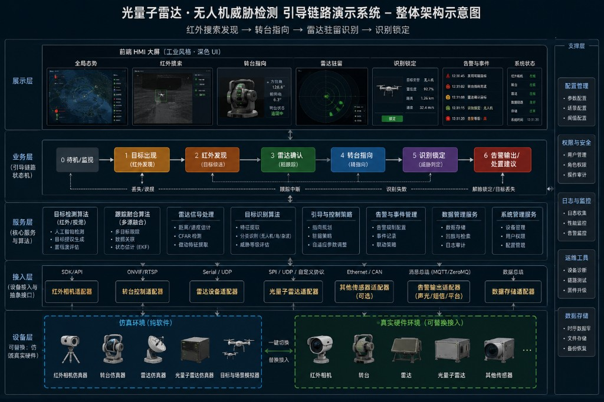
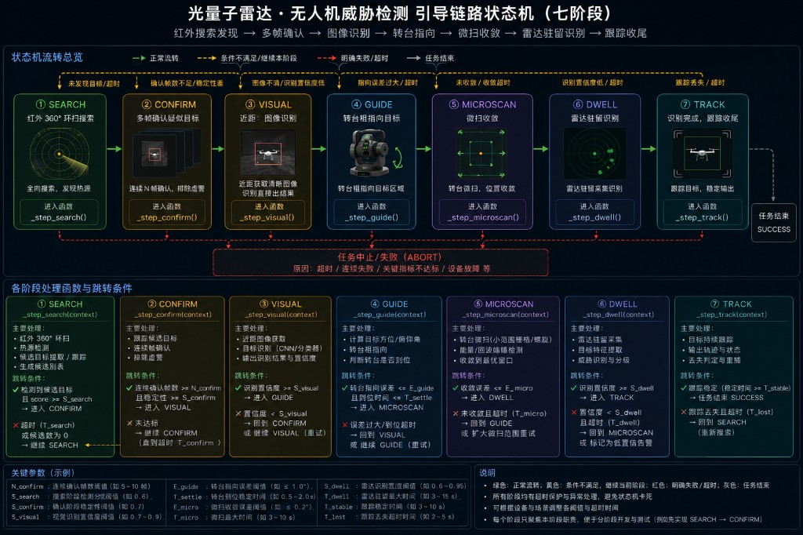
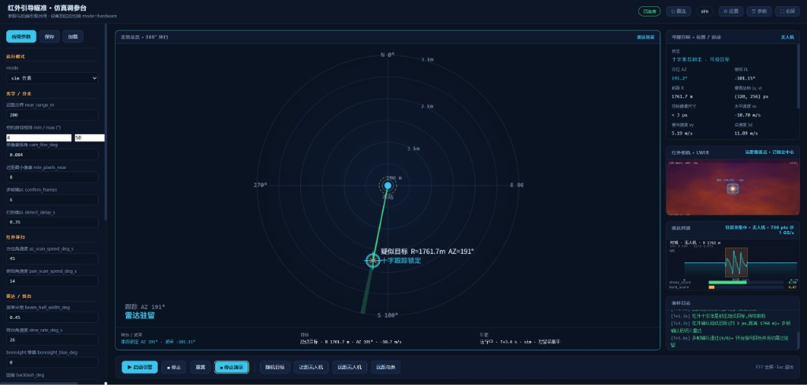

# 用 Cursor 打造光量子雷达仿真转台系统

## 项目背景 - 为什么要先做"仿真"再碰硬件

> 为什么不直接对接真实的转台、红外相机和雷达？

> 因为真实设备联调成本高、排期慢，一旦某个环节的协议或参数没想清楚，返工代价很大。更稳妥的做法是先用纯软件把"目标出现 → 红外发现 → 雷达确认 → 转台指向 → 识别锁定"这条完整链路在仿真环境里跑通，把状态流转、边界条件和交互细节都打磨好，再把仿真接口替换成真实硬件驱动。

这个项目要做的是一套"光量子雷达 · 无人机威胁检测"的引导链路演示系统：红外相机负责搜索发现，转台负责指向，雷达负责驻留识别，前端做成一套工业风格的深色 HMI 大屏。整个后端状态机、前后端联调、UI 视觉细节，都是在 Cursor 里通过多轮对话逐步完成的。



## 第一步：把"一整套联动"拆成可独立验证的状态机

> 为什么要先设计状态机，而不是直接写业务逻辑？

> 一整套目标搜索、确认、跟踪的流程如果写成一堆 if/else，AI 和人都很难看清边界条件在哪里、下一步该做什么。把流程显式地写成状态机，每个状态只负责一件事，既方便让 AI 逐个状态实现和单独测试，也方便后续排查"卡在哪一步"。

向 AI 描述需求时，我们把整条引导链路拆成了七个明确的阶段：

```python
class Stage(str, Enum):
    SEARCH = "SEARCH"        # 红外 360° 环扫搜索
    CONFIRM = "CONFIRM"      # 多帧确认疑似目标
    VISUAL = "VISUAL"        # 近距：图像识别直接出结果
    GUIDE = "GUIDE"          # 转台粗指向目标
    MICROSCAN = "MICROSCAN"  # 转台到位后的微扫收敛
    DWELL = "DWELL"          # 雷达驻留采集识别
    TRACK = "TRACK"          # 识别完成，跟踪收尾
```

每个阶段对应一个独立的 `_step_xxx` 处理函数，状态之间的跳转条件（比如"确认帧数够了就进入驻留"）也写得很直白。这样在和 AI 迭代的时候，可以每次只聚焦一个阶段："先只实现 SEARCH 到 CONFIRM 的跳转逻辑，其它阶段先留空"，而不是让 AI 一次性吞下整条链路。



## 第二步：仿真与硬件共用一套接口，降低后期替换成本

> 为什么要一开始就区分 sim / hardware 两种模式？

> 如果一开始就把仿真的随机数生成逻辑和真实设备的通信逻辑写在一起，以后接硬件的时候基本要推倒重来。更好的做法是先定义好"相机 / 转台 / 雷达"三个抽象接口，仿真阶段用假数据实现这三个接口，以后硬件到位了只需要写一份新的实现，业务逻辑完全不用动。

这一点是在最初的架构讨论里就明确要求 AI 遵守的约束，最终落地成了一层适配器：

```python
class CameraAdapter(ABC):
    @abstractmethod
    def poll_detections(self) -> list[dict]: ...

class TurretAdapter(ABC):
    @abstractmethod
    def command_angle_deg(self, el_deg: float) -> None: ...

class RadarAdapter(ABC):
    @abstractmethod
    def poll_classification(self) -> dict | None: ...
```

配置里也用一个 `mode: "sim" | "hardware"` 字段统一控制，所有可调参数（扫描速度、波束半宽、微扫幅度、驻留时长等）全部放进同一份 `GuidanceConfig`，仿真和硬件共用：

```python
mode: Mode = "sim"
slew_rate_deg_s: float = 26.0       # 转台转速
beam_half_width_deg: float = 0.45   # 雷达波束半宽
dwell_time_s: float = 3.2           # 驻留识别时长
```

给 AI 提需求时反复强调"参数不要写死在函数里，一律放进配置对象"，后续调参、做敏感性测试时就不需要再改代码。

## 第三步：前端 HMI 页面细节的多轮微调

> 为什么页面视觉细节要反复来回改？

> 工业风格的监控大屏对信息密度、配色、动效克制程度要求很高，第一版 AI 生成的界面往往偏"通用后台管理系统"的味道——渐变色多、字体花哨。真正贴近"雷达值守屏幕"的观感，需要一轮一轮地把这些通用感的元素替换成更克制、更专业的表达。

这个"红外引导规避·仿真调参台"页面同样基于 Vite + React + TypeScript 技术栈搭建，最终确定的布局要点是：

- 左侧参数面板：运行模式（仿真/硬件）切换，以及光学俯仰、红外检测、微扫/闭环、转台与波束等各组可调参数，全部实时可调、即改即生效
- 中间极坐标态势图：以站点为圆心展示目标的距离与方位，扫描/跟踪过程中的状态会直接标注在图上（如"疑似目标 R=1761.7m AZ=191°""跟踪 AZ 191°""雷达驻留"）
- 右上红外画面：十字准星 + 疑似目标位置，暖色调热成像风格
- 右侧目标信息与滚动日志：实时目标参数（距离、方位、径向速度等）与带时间戳的事件日志
- 底部波形/频谱图 + 操作区：启动/停止仿真、重置，以及"随机目标""近距无人机""远距无人机""远距鸟类"等预设目标触发按钮，方便针对不同场景反复调参验证
- 整体深色调参台风格，参数面板与态势图分区清晰，便于一边调参数一边看效果

这些细节不是一次性提出来的，而是在看到 AI 第一版输出后，针对"哪里像模板""哪里不够克制"逐条反馈、逐条修正得到的。



### 让 AI 自己审视输出，而不是单方面接受反馈

> 为什么不是我发现问题、AI 改就完了，还要让 AI"自己审视"？

> 人盯着界面一遍遍挑毛病，效率并不高，而且容易漏掉一些"说不清哪里不对，但感觉不对"的细节。更有效的做法是每次 AI 输出一版界面或一段代码后，主动要求它**先自己复盘一遍**：这版实现有没有偏离最初的设计要求？有没有边界情况没考虑到？如果让它反过来问我问题，它会问什么？

具体做法是在每一轮迭代之后，追加类似这样的要求，而不是直接给下一条修改指令：

- "先说说你觉得这版实现里，哪些地方可能不符合最初的要求，或者你不确定的地方有哪些。"
- "如果你觉得某个设计决策模棱两可，直接反问我，不要自己猜一个答案就往下写。"
- "假设一个挑剔的评审来看这版界面，他会挑出哪些问题？"

这样做的好处是：一方面能让 AI 把一些"隐藏假设"暴露出来（比如某个交互在什么情况下会出问题、某个参数是拍脑袋定的），另一方面也能倒逼 AI 主动提问，而不是在信息不全的情况下强行给出一个"看起来合理"的答案，减少了返工次数。

## 用 AI 做仿真系统开发的关键词与注意事项

整个过程里，总结出几条比较关键的经验：

1. **先定义状态/接口，再写实现**：明确的状态机命名和阶段划分，能让 AI 生成的代码天然具备清晰的边界，也方便分阶段验收。
2. **参数一律配置化，不写死**：明确要求"所有可调数值放进配置类"，既方便后续调参，也方便以后切换到硬件模式时逐项核对。
3. **仿真与硬件复用同一套抽象接口**：提前把"以后要换真实设备"这个约束告诉 AI，能避免后期大规模重构。
4. **角度类计算要专门处理环绕问题**：方位角在 0°–360° 之间跳变，直接相减会出错，需要显式要求 AI 使用"最短夹角"的差值函数（如 `_signed_ang_diff_deg`），这个坑如果不提前说明，AI 很容易写出错误的角度插值逻辑。
5. **时间步进要考虑仿真加速**：`step(dt)` 里统一让 `dt` 乘以 `sim_speed`，方便调试时加速回放，这个需求需要明确提出，否则 AI 默认不会考虑"倍速仿真"这种场景。
6. **UI 微调时给出具体的视觉参照，而不是抽象描述**：与其说"再专业一点"，不如直接给出色值、参照的行业风格（如"深色 HMI 监控屏"），反馈效率高很多。
7. **每次只改一个模块，方便审查 diff**：无论是后端状态机还是前端组件，一次对话尽量聚焦一个文件/一个功能点，方便逐条核对改动是否符合预期。
8. **让 AI 自己复盘、主动提问，而不是只等人来挑错**：每轮迭代后要求 AI 先自评"这版有没有偏离要求、有没有拿不准的地方"，遇到模糊需求让它直接反问而不是自己猜答案，能提前暴露隐藏假设，减少来回返工的次数。

---

## 相关链接和资料

[Vite 官方文档](https://vitejs.dev/)

[React 官方文档](https://react.dev/)

[ECharts](https://echarts.apache.org/)
