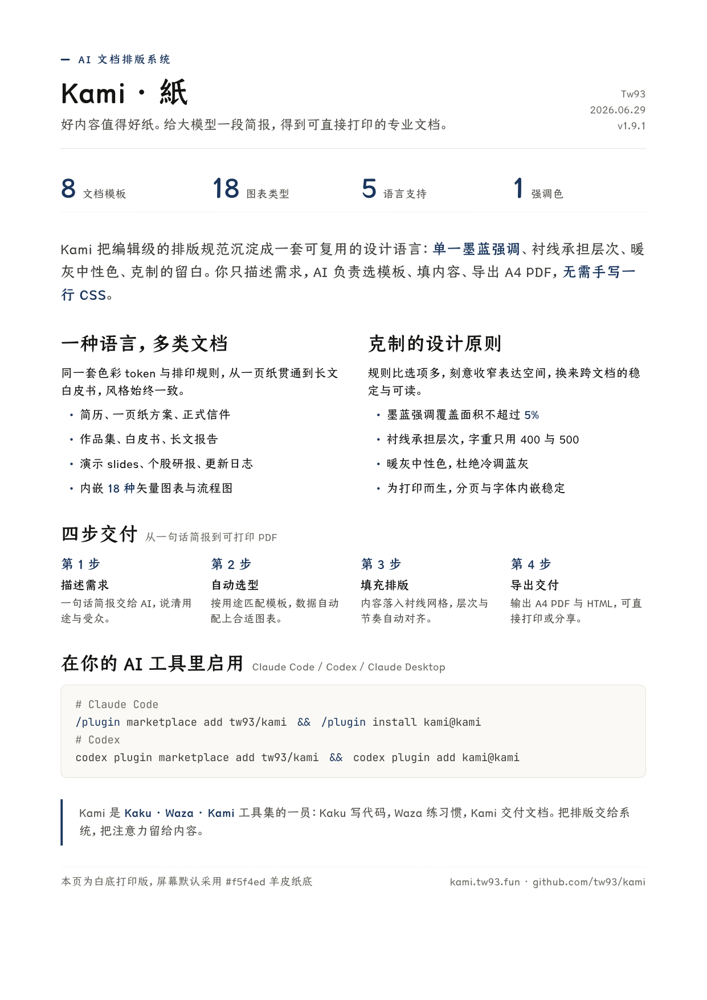
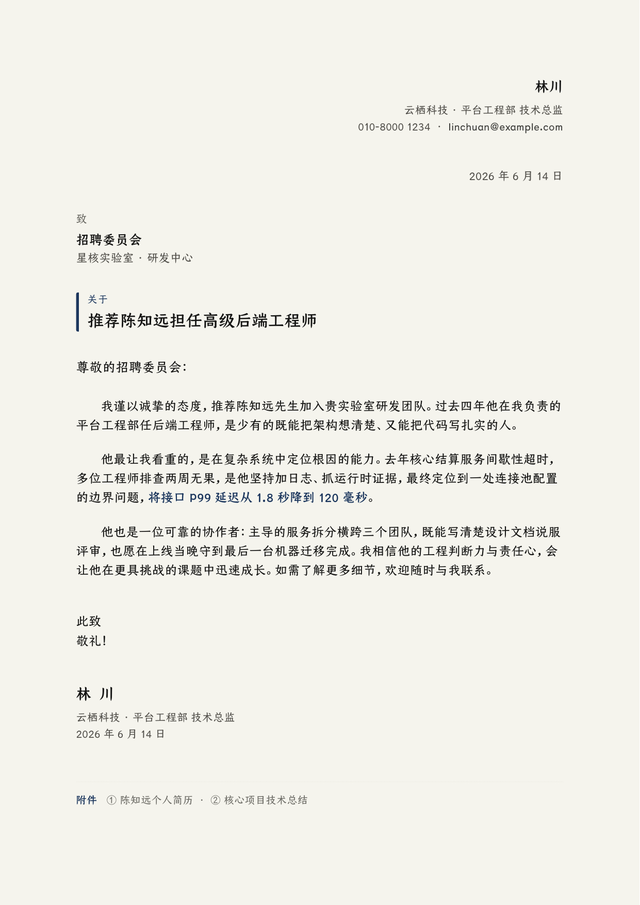
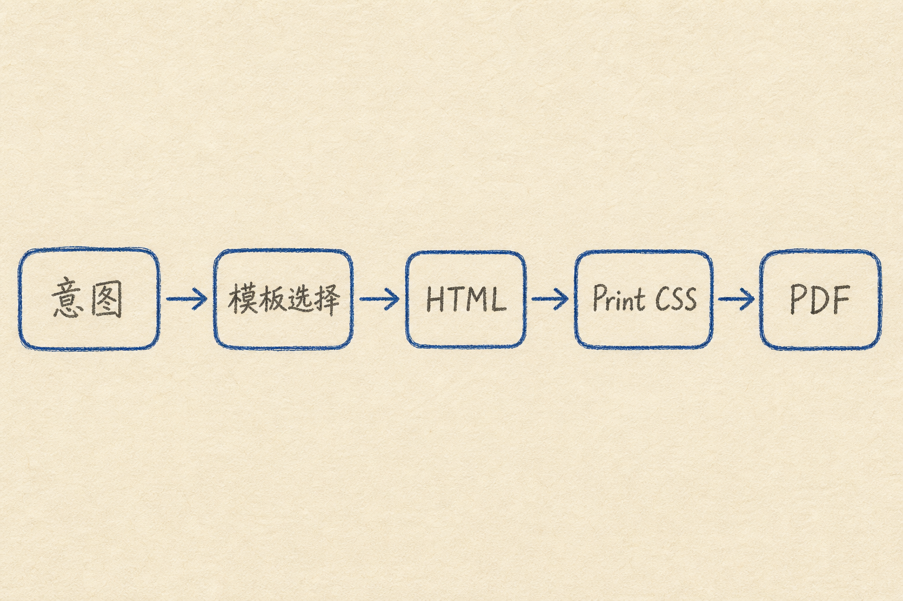
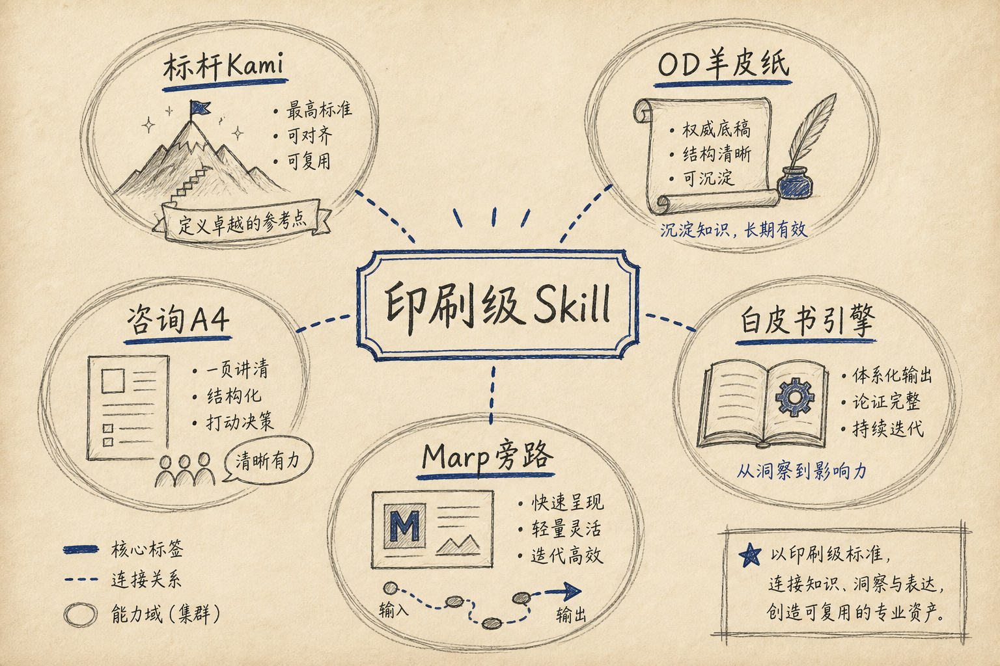
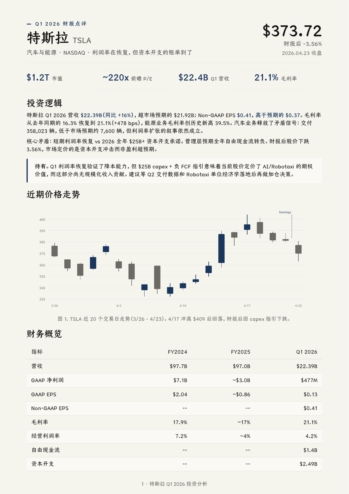
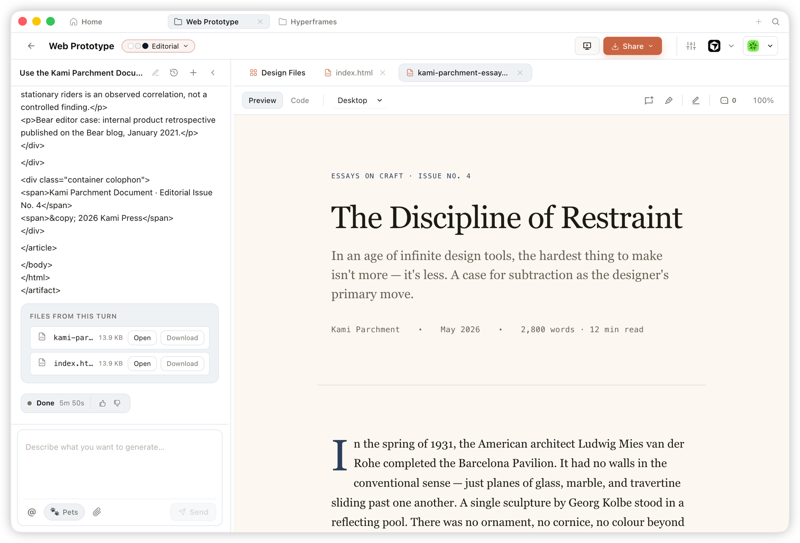
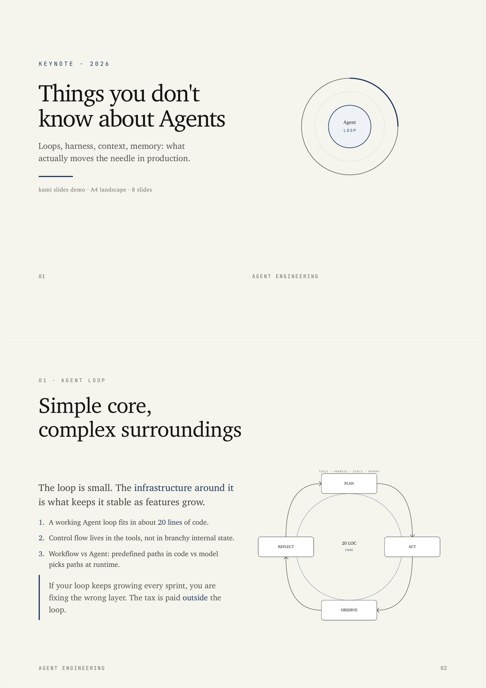
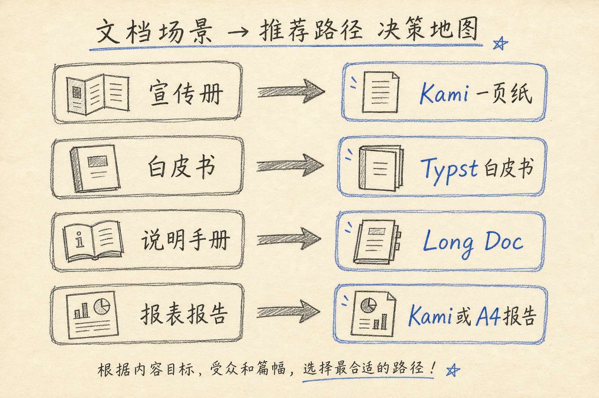

# HTML 打印级文稿生成 Skill 选型指南

## 1. 引言与问题界定

### 1.1 背景

智能体（Agent）已能稳定产出结构化文案，但交付物若缺少可复用的印刷约束，往往退化为灰底、松散、会话间不一致的“默认文档”。对报表、报告、宣传册、白皮书与说明手册而言，读者感知的是版面可信度，而非模型词数。缺口不在写作能力，而在把内容落到“像纸一样可交付”的版式系统。

### 1.2 目标交付物

本文面向下列五类文稿的选型与落地：

| 文稿类型 | 典型形态 | 页数量级 |
|----------|----------|----------|
| 报表 | 指标页、财报点评、周期性经营回顾 | 1–8 页 |
| 报告 | 调研长文、技术方案说明、咨询式分析 | 3–30 页 |
| 宣传册 | 一页纸、产品简介、执行摘要 | 1 页 |
| 白皮书 | 产品或技术主张的长篇论证 | 8 页以上 |
| 说明手册 | 操作说明、部署手册、用户指南 | 多页、强目录 |

### 1.3 技术路径约定

本文默认路径为：

**结构化内容或自然语言简报 → 自包含超文本标记语言（HyperText Markup Language，HTML）→ 打印用级联样式表（Cascading Style Sheets，CSS）→ 便携式文档格式（Portable Document Format，PDF）。**

“自包含”指单文件内联样式与必要资源引用，打开浏览器即可预览，再经打印对话框或无头浏览器 / WeasyPrint 等引擎导出 PDF。不以 Microsoft Word / PowerPoint 二进制编辑作为主线。

### 1.4 本文范围

纳入范围：与 Kami 同族的排版展示类 Agent Skill——具备模板或强设计约束，并以 HTML（或等价标记）通向良好 PDF 打印。

不展开：以 `docx` / `pptx` / `xlsx` 二进制读写为主的格式技能；Skill 管理图形界面；任务完成通知类工具。后文第 4.6 节给出降权说明，避免误选。

### 1.5 评价维度

后文对比统一使用下列维度：文稿类型覆盖、HTML 自包含程度、PDF 打印成熟度、设计约束强度、校验门禁、中文与中日韩（CJK）支持、依赖与安装成本、社区热度（安装量或星标，作参考而非唯一依据）。

## 2. 参照系：Kami 为何成为标杆

### 2.1 产品定位

Kami（紙）是面向智能体的印刷约束系统，而非界面组件库。其主张是：好内容值得好纸面；缺的不是生成能力，而是足够严格、又足够简单、能让智能体稳定执行的设计语言。官方表述见 [tw93/Kami](https://github.com/tw93/Kami)。

### 2.2 视觉签名

典型签名包括：暖羊皮纸画布（约 `#f5f4ed`）、单一墨蓝强调色（约 `#1B365D`）、衬线主导层级、拒绝厚重阴影与多色霓虹。文档应读作“排过版的纸”，而非仪表盘。中文优先配合仓耳今楷等衬线路径，英文使用 Charter 等衬线；打印场景可切换白底变体以便办公打印。





### 2.3 文档类型覆盖

Kami 覆盖一页纸、长文档、信件、作品集、简历、幻灯片、股权 / 财报点评、变更日志，以及落地页系统；并配套内容结构约定、图表与视觉检查。自然语言即可触发，无需强制斜杠命令。

### 2.4 工程能力摘要

| 能力 | 说明 |
|------|------|
| 模板填充 | 按语言与文档类型选择 HTML / 幻灯片模板 |
| 内容契约 | 按类型 schema 校验结构与事实覆盖 |
| 视觉门禁 | 导出页图，按清单做视觉检查 |
| 打印导出 | WeasyPrint 等路径；幻灯片另支持可编辑演示文稿与 Marp 变体 |
| 品牌档案 | 可选 `~/.config/kami/brand.md` 持久化身份与默认色 |
| 模型上下文协议 | 可选本地 MCP 暴露渲染与检查工具 |

### 2.5 可抽象的选型标准

从 Kami 可抽象出选型硬指标，供评估同类 Skill：

1. 是否声明固定视觉签名（画布、强调色、字体层级），避免会话漂移。
2. 是否按文稿类型给出模板或版式骨架，而非“自由发挥排版”。
3. 是否以自包含 HTML（或等价标记）为中间产物，并显式支持打印 CSS（`@page`、分页、背景保留）。
4. 是否具备内容或版面校验（结构、单页适配、视觉 QA 至少其一）。
5. 是否对中文 / CJK 有可复现的字体与行高策略。
6. 是否提供可安装的 Skill 包与可核对的示例交付物。
7. 依赖是否可在本机或 CI 中复现，而非绑定封闭托管。

## 3. 共性工作流：HTML 优先的打印交付模型

### 3.1 流水线



**意图识别**

从用户简报判断文稿类型、页数、受众与语言。

**模板或类型选择**

映射到一页纸、长文、信件、手册等骨架。

**HTML 生成**

填充标题、章节、图表占位与页脚元数据；样式内联或可预测地外链。

**打印 CSS**

设定纸张（常见 A4）、边距、分页规则、页眉页脚、背景图是否打印。

**PDF 导出**

浏览器打印另存，或无头 Chromium / WeasyPrint 批处理。

### 3.2 打印质量要点

| 要点 | 建议 |
|------|------|
| 纸张与边距 | 明确 `@page { size: A4; }` 与边距，避免屏幕预览与 PDF 不一致 |
| 分页 | 避免标题落在页末；长表格允许跨页并重复表头（若引擎支持） |
| 背景 | 办公打印需勾选“背景图形”，或提供白底变体 |
| 字体 | 嵌入或本机可解析的 CJK 字体；缺字时预先回落而非方框 |
| 色彩 | 印刷向交付控制强调色数量；深色块需确认灰度可读性 |

### 3.3 两条导出路径

| 路径 | 适用 | 特点 |
|------|------|------|
| 浏览器 Print-to-PDF | 零依赖演示、咨询风单文件 HTML | 操作简单；需统一打印设置清单 |
| WeasyPrint / 无头 Chromium | Kami、提案流水线、自动化批处理 | 可脚本化；依赖安装与字体配置 |

Adobe Typst 白皮书等路径以排版引擎直接出 PDF，中间件未必是浏览器 HTML；后文第 4.4 节单独对照，不与“纯 HTML 打印”混为一谈。

### 3.4 与本仓库 DOCX 路线的边界

本仓库技术方案、标书类交付默认以 Markdown 为唯一正文来源，经 [`scripts/md_to_docx.py`](../../scripts/md_to_docx.py) 生成中文标书体裁 Word 文档。该路径适合公文体、内部评审与可修订协作。

对外需要“印刷感”展示 PDF、一页纸宣传册、正式信件、羊皮纸风长报告时，应改走本文所述 HTML→PDF Skill（Kami 或 `doc-kami-parchment` 等）。两条链路互补：DOCX 管规范与修订，HTML→PDF 管展示与传播。

## 4. 候选 Skill 图谱



下列各节结构统一为：定位、适用文稿、HTML/PDF 能力、安装与触发、优势与边界。

### 4.1 标杆：tw93/Kami

**定位**

印刷约束语言 + 多文档模板 + 校验与导出工具链；中英优先，日韩尽力支持。

**适用文稿**

宣传册（一页纸）、报告与白皮书体长文、信件、简历与作品集、财报点评式报表、幻灯片；亦可延伸落地页。

**HTML/PDF 能力**

以 HTML 模板为中心，经 WeasyPrint 等导出 PDF；提供白底打印变体；含内容 schema 与视觉检查。



**安装与触发**

```bash
# 通用 Agent（推荐 plugin 路径，避免只装到根 SKILL.md）
npx skills add tw93/kami/plugins/kami -a universal -g -y
```

自然语言示例：“帮我做一份一页纸”“帮我排版一份长文档”“帮我写一封正式信件”。

**优势与边界**

优势：约束完整、示例丰富、中文友好、工程门禁齐全。边界：视觉语言高度统一，若必须严格贴合企业 VI，需配置品牌档案或二次改模板；重度依赖本机字体与 Python 打印栈。

### 4.2 近亲：open-design · doc-kami-parchment

**定位**

[Open Design](https://github.com/nexu-io/open-design) 官方示例模板中的 Kami 羊皮纸文档 Skill。意图写明：严肃排版文档（一页纸 / 长报告 / 信函 / 简历 / 财报 / changelog / portfolio），强调“写得像被排过版的纸”。视觉硬约束与 Kami 同源（羊皮纸底、墨蓝单强调、单语种单衬线）。

**适用文稿**

与 Kami 文档类型高度重叠；适合已在 Open Design 中做原型、幻灯片或设计系统的团队，在同一生态内完成纸质感文稿。

**HTML/PDF 能力**

产出面向预览与导出的 HTML 制品，经 Open Design 的预览 / PDF 导出链路交付。与独立 Kami 相比，更偏“设计模板”，校验与字体恢复脚本不如 Kami 本体完整。



**安装与触发**

```bash
npx skills add https://github.com/nexu-io/open-design --skill doc-kami-parchment
```

**Open Design 相邻模板（互补）**

同一仓库内并非存在多个 `doc-*` 平行包；长报告 / 信函 / 简历 / 财报等多类型主要由 `doc-kami-parchment` 内部路由覆盖。相邻场景可选用例如：`finance-report`（财务看板式 HTML）、`resume-modern`、`huashu-annual-letter`、`hps-academic-paper`、`digital-eguide` 等，风格各异，不宜全部当作羊皮纸 Kami 替代品。

**优势与边界**

优势：与 OD 设计系统、Studio 工作流一体；仓库体量大、模板簇丰富。边界：严肃纸质交付若只需 Kami 能力，安装完整 OD 偏重；审计与安装量以具体 Skill 页为准。

### 4.3 咨询 A4：Pysamlam/a4-report

**定位**

面向 Claude Code 等环境的咨询风 A4 报告 Skill：麦肯锡 / BCG / 贝恩式信息层级，零构建依赖，单文件 HTML，浏览器打印为 PDF。

**适用文稿**

多页咨询报告、经营分析、结构化汇报；弱于信件与作品集等Kami全品类。

**HTML/PDF 能力**

内联 CSS、`@page` A4、打印媒体查询；引导开启背景图形后另存 PDF。可选数据审计步骤核对数字来源。

**安装与触发**

将仓库 Skill 目录安装到 Agent skills 路径后，以“生成咨询报告 / A4 report”类请求触发。仓库：[Pysamlam/a4-report](https://github.com/Pysamlam/a4-report)。

**优势与边界**

优势：路径短、依赖少、咨询叙事清晰。边界：社区星标很少，视觉体系不如 Kami 成熟；需自行固定打印设置清单。

### 4.4 白皮书旁路：adobe/skills · whitepaper

**定位**

将 Markdown 经 Pandoc 与 Typst 模板排版为专业白皮书 PDF；内置 Source Sans 等字体资源。页面：[skills.sh/adobe/skills/whitepaper](https://skills.sh/adobe/skills/whitepaper)。

**适用文稿**

白皮书、长篇技术主张、需要稳定学术 / 产品白皮书观感的长文。

**与 HTML 打印路径的异同**

| 项 | HTML→打印 PDF | Typst 白皮书 |
|----|---------------|--------------|
| 中间产物 | 浏览器可预览 HTML | Typst / 中间标记 |
| 调版方式 | 改 HTML/CSS | 改 `.typ` 模板与 Markdown |
| 自动化 | 易与无头浏览器衔接 | 依赖 Pandoc + Typst 工具链 |
| 观感 | 编辑部纸面或咨询风 | 传统专业排版白皮书 |

若组织已统一 HTML Skill，长文可优先 Kami Long Doc；若目标是“标准白皮书书册感”且接受 Typst，选用本 Skill。

**安装**

```bash
npx skills add https://github.com/adobe/skills --skill whitepaper
```

**对照：MiniMax minimax-pdf**

[minimax-pdf](https://skills.sh/minimax-ai/skills/minimax-pdf) 提供新建 / 填表 / 重排三类 PDF 管线（含封面脚本）。适合“从零生成或重绘 PDF”而非浏览器 HTML 编辑；审美约束弱于 Kami，可作封面型交付备选，不作为本文 HTML 主路径推荐。

### 4.5 幻灯片旁路：robonuggets/marp-slides

**定位**

基于 Marp（Markdown Presentation Ecosystem）的演示文稿 Skill：Markdown 源稿导出 HTML / PDF / PPTX；仓库含多套范例与图表组件。[robonuggets/marp-slides](https://github.com/robonuggets/marp-slides)。

**适用文稿**

学术与技术分享、大纲即稿的路演材料；不是宣传册或白皮书正文主路径。

**与 Kami / OD 幻灯片的分工**

需要羊皮纸印刷感幻灯片时，优先 Kami Slides 或 Open Design 的 `kami-deck` / 编辑风 `html-ppt-*`。需要 Markdown 源可版本管理、快速改页时，优先 Marp。



**安装**

```bash
npx skills add https://github.com/robonuggets/marp-slides --skill marp-slides
```

说明：Kami 本体亦含 Marp 模板目录；已安装 Kami 时，“Markdown 风演示稿”可直接走 Kami，无需强制再装一套。

### 4.6 明确降权项（防误选）

| 名称 | 实际用途 | 为何不纳入主推 |
|------|----------|----------------|
| SkillDeck | 多 Agent Skill 安装与分发的 macOS 管理界面 | 不生成文稿版式 |
| agent-notifier / agent-notify | 任务完成或待授权时的桌面 / 多通道通知 | 与排版无关 |
| anthropics pdf / docx / pptx | 官方文档格式读写与处理 | 格式基建强，但缺少 Kami 级印刷设计系统；宜作互补底层 |

## 5. 横向对比

### 5.1 对比表

| 维度 | Kami | doc-kami-parchment | a4-report | whitepaper (Typst) | marp-slides |
|------|------|--------------------|-----------|--------------------|-------------|
| 宣传册 / 一页纸 | 强 | 强 | 弱 | 弱 | 不适用 |
| 报告 / 手册长文 | 强 | 强 | 强（咨询风） | 强（白皮书风） | 弱 |
| 信件 | 强 | 强 | 弱 | 弱 | 不适用 |
| 报表点评 | 强（含股权报告模板） | 中（类型内支持） | 中 | 弱 | 弱 |
| HTML 自包含 | 是（模板体系） | 是（OD 制品） | 是（单文件） | 否（Typst） | Markdown→HTML |
| 打印 / PDF 成熟度 | 高（引擎+门禁） | 中高（依赖 OD 导出） | 中（浏览器打印） | 高（排版引擎） | 高（Marp CLI） |
| 设计约束强度 | 很高 | 很高（同源签名） | 中（咨询模板） | 中高（模板字体） | 中（主题/范例） |
| 校验门禁 | schema + 视觉 | 弱于 Kami | 数据审计可选 | 工具链校验 | 清单 / 范例驱动 |
| 中文 / CJK | 一等公民 | 一等公民（约束声明） | 视实现 | 视字体包 | 可行 |
| 依赖 | Python / 字体 / WeasyPrint 等 | Open Design 生态 | 浏览器即可 | Pandoc + Typst | Node / Marp CLI |
| 热度参考 | 约 1 万星 / 安装 | OD 大仓 + 千级安装 | 星标很少 | 约千级安装 | 约数百星 |

数据随时间变化，选型以官方仓库与 [skills.sh](https://skills.sh/) 页面为准。

### 5.2 场景—Skill 速查



| 场景 | 首选 | 备选 |
|------|------|------|
| 产品一页纸 / 宣传册 | Kami One-Pager | doc-kami-parchment |
| 正式信件 / 推荐信 | Kami Letter | doc-kami-parchment |
| 咨询风多页 A4 报告 | a4-report | Kami Long Doc |
| 羊皮纸风调研长文 / 手册 | Kami Long Doc | doc-kami-parchment / digital-eguide |
| 标准白皮书书册感 | adobe whitepaper | Kami Long Doc |
| 财报 / 指标点评页 | Kami Equity Report | finance-report（OD） |
| 技术分享幻灯片 | marp-slides 或 Kami Marp | Kami WeasyPrint Slides |
| 中文标书 / 可修订公文 | 本仓库 `md_to_docx` | 不建议强行 Kami 替代 |

### 5.3 组合用法

- **展示 + 生态**：Open Design 做产品原型与幻灯片，纸质感长文与一页纸用 `doc-kami-parchment` 或独立 Kami。
- **白皮书 + 摘要页**：Typst 出白皮书正文，Kami 出一页纸执行摘要，视觉分别服务“书册”与“传播”。
- **规范 + 传播**：内部评审走 DOCX；对外 PDF 走 Kami，同源 Markdown / 素材库，分轨渲染。

## 6. 推荐选型与落地建议

### 6.1 默认栈

| 交付 | 默认选择 |
|------|----------|
| 宣传册 / 一页纸 / 正式信件 / 羊皮纸风报告 | Kami；已在 OD 内则 `doc-kami-parchment` |
| 咨询风多页 A4 | a4-report；要统一纸面美学则 Kami Long Doc |
| 白皮书长文 | adobe whitepaper；坚持 HTML 工具链则 Kami Long Doc |
| 说明手册 | Kami Long Doc，强化目录、页码与分页规范；OD 内可对照 `digital-eguide` |
| 路演幻灯片 | marp-slides 或 Kami 内置 Marp / Slides |

### 6.2 与现有仓库工作流衔接

- 技术方案、标书、内部汇报：继续 Markdown + `scripts/md_to_docx.py`（版式见 [`DOCX.md`](../../DOCX.md)）。
- 对外印刷感 PDF、英文材料、一页纸与信件：安装 Kami 或 `doc-kami-parchment`，素材可从同一 Markdown / 纪要抽取。
- 配图：架构图仍可用仓库 diagram 技能或既有 `images/`；纸面内嵌图遵循各 Skill 的单色 / 内联 SVG 约定，避免破坏羊皮纸签名。

### 6.3 品牌一致性

- Kami：维护 `~/.config/kami/brand.md`（姓名、色、语气、纸张默认）。
- Open Design：维护项目级 `DESIGN.md`，令文稿与原型同色同字。
- 多主题演示：可叠加 anthropics `theme-factory`，但勿与 Kami 硬签名同时抢强调色。

### 6.4 交付前质量门禁

1. 文稿类型与页数是否与模板匹配（一页纸是否溢出）。
2. 事实与数字是否全部进入成品（无“写了但没排上”）。
3. 打印预览下标题是否孤行、表格是否截断。
4. CJK 是否缺字；英文混排间距是否可读。
5. 强调色是否唯一、背景是否按需保留或切换白底。
6. 页眉页脚、密级或来源标注是否齐全。
7. PDF 文件名、元数据标题与对外版本号是否一致。
8. 若走浏览器打印：纸张 A4、边距、背景图形三项是否勾选正确。

## 7. 安装与最小验证

### 7.1 推荐安装命令汇总

```bash
# 标杆：Kami
npx skills add tw93/kami/plugins/kami -a universal -g -y

# OD 羊皮纸近亲
npx skills add https://github.com/nexu-io/open-design --skill doc-kami-parchment

# Typst 白皮书
npx skills add https://github.com/adobe/skills --skill whitepaper

# Marp 幻灯片
npx skills add https://github.com/robonuggets/marp-slides --skill marp-slides
```

a4-report 按仓库 README 将 Skill 目录加入 Agent skills 路径。Skill 管理可选用 SkillDeck 图形界面做分发，但不参与排版本身。

### 7.2 最小验证用例

取同一段产品简介素材（约 400–800 字 + 3 个要点指标）：

1. 用 Kami 生成一页纸，导出 PDF，检查是否严格一页、背景与字体正常。
2. 用 Kami Long Doc 或 a4-report 生成 3–5 页报告，检查分页与目录 / 章节层级。
3. （可选）用 whitepaper 将加长 Markdown 导出白皮书 PDF，对比书册感与 HTML 路径差异。

### 7.3 常见失败

| 现象 | 处理 |
|------|------|
| 中文方框或缺字 | 安装 Skill 字体脚本或系统衬线；检查 CDN / 本机字体路径 |
| PDF 无背景色块 | 打印对话框启用背景图形，或改用白底变体 |
| 一页纸溢出 | 压缩要点、减小图示，或改用长文模板 |
| 标题落在页末 | 调整分页 CSS / 段落 keep-with-next |
| 只装到残缺 SKILL.md | Kami 使用 `tw93/kami/plugins/kami` 路径重装 |

## 8. 结论与后续

### 8.1 核心判断

与 Kami 同级、以 HTML（或等价标记）通向打印级 PDF 的公开 Skill 中，Kami 仍是圆心：约束、模板、门禁与中文支持最完整。doc-kami-parchment 是 Open Design 生态内的近亲模板；a4-report 补咨询风短链路；whitepaper 补 Typst 白皮书书册感；marp-slides 补 Markdown 演示旁路。格式读写类官方 Skill 与 SkillDeck / 通知类工具应降权，避免占用“排版选型”预算。

### 8.2 可扩展方向

可在企业内部沉淀自有“约束 Skill”：吸收第 2.5 节七项指标，注入国光或项目视觉规范（色、字体、页眉密级、免责声明），仍保持 HTML→PDF 主路径，并与现有 `md_to_docx` 分轨。

### 8.3 参考链接

| 资源 | 链接 |
|------|------|
| Kami | https://github.com/tw93/Kami |
| Kami · skills.sh | https://skills.sh/tw93/kami/kami |
| Open Design | https://github.com/nexu-io/open-design |
| doc-kami-parchment | https://skills.sh/nexu-io/open-design/doc-kami-parchment |
| a4-report | https://github.com/Pysamlam/a4-report |
| adobe whitepaper | https://skills.sh/adobe/skills/whitepaper |
| minimax-pdf | https://skills.sh/minimax-ai/skills/minimax-pdf |
| marp-slides | https://github.com/robonuggets/marp-slides |
| Agent Skills 目录 | https://skills.sh/ |

版本说明：本文调研时点为 2026-07；安装量与星标会变动，落地前请复核官方页面。

## 附录 A. 名词表

| 名词 | 说明 |
|------|------|
| Agent Skill | 供智能体加载的程序性知识包，通常含 `SKILL.md`、模板与脚本 |
| 自包含 HTML | 单文件即可预览的 HTML，样式与关键资源可内联或可预测解析 |
| Print CSS | 面向打印媒体的样式，含 `@page`、分页、页边距等 |
| WeasyPrint | 将 HTML/CSS 渲染为 PDF 的 Python 工具 |
| Typst | 现代排版系统，常用于论文与白皮书 PDF |
| Marp | 以 Markdown 编写幻灯片并导出 HTML/PDF/PPTX 的生态 |
| CJK | 中日韩文字排版相关字体与断行问题的统称 |

## 附录 B. 文稿类型—模板映射速查

| 文稿类型 | Kami | doc-kami-parchment | 其他 |
|----------|------|--------------------|------|
| 宣传册 | one-pager | One-Pager | — |
| 报告 / 手册 | long-doc | Long Doc | a4-report；digital-eguide |
| 信件 | letter | Letter | huashu-annual-letter |
| 白皮书 | long-doc | Long Doc | adobe whitepaper |
| 报表点评 | equity-report | Equity Report | finance-report |
| 幻灯片 | slides / Marp | Slides | marp-slides；OD html-ppt-* |

## 附录 C. 与 Office 编辑类 Skill 对照

| 能力 | 印刷展示类（本文） | Office 编辑类（anthropics 等） |
|------|--------------------|--------------------------------|
| 主产物 | HTML→PDF（展示纸面） | docx / pptx / xlsx |
| 设计系统 | 强约束模板 | 弱到中，偏操作正确性 |
| 修订协作 | 弱（以终稿 PDF 为主） | 强（修订、批注、可编辑） |
| 推荐场景 | 对外传播、一页纸、印刷感报告 | 内部标书、可编辑汇报、表格模型 |

二者应组合：内部定稿与对外传播分轨，而不是互相替代。
