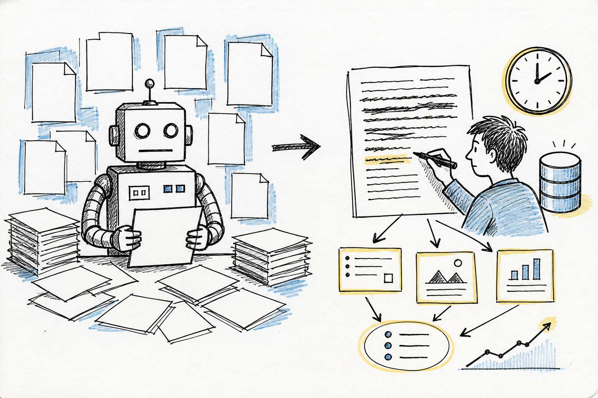
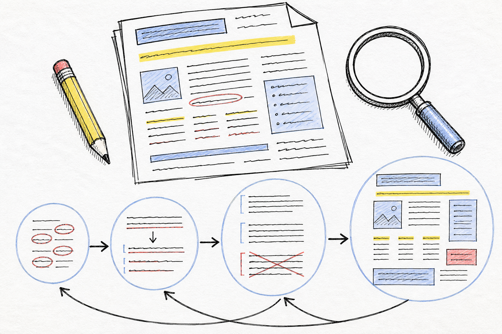

# 如何去除中文文章中的 AI 味

“去 AI 味”不是把文章改成聊天，也不是想办法骗过检测器。更可靠的做法是把事实说清楚：谁做了什么，做到哪一步，还有哪些限制。事实摆出来以后，再删掉套话，调整句子的节奏。原句已经准确，就不要继续加工。

先看一段虚构的系统故障复盘。

**改之前：**

> 在数字化转型持续推进的背景下，系统稳定性成为业务高质量发展的重要保障。本次故障暴露出监控体系、协同机制和应急响应流程存在一定不足。通过本次复盘，我们将进一步优化相关机制，提升平台整体可靠性，为后续业务稳定运行奠定坚实基础。

**改之后：**

> 6 月 12 日 10:14，订单接口开始间歇性超时。值班同事先回滚了当天的配置，13 分钟后恢复。复盘发现，超时来自一个没有限制返回条数的查询；现有监控只报警接口错误，没有监控数据库连接池。下周补上查询上限和连接池告警，发布前增加一次压测。

第一段把一次故障复盘写成了“数字化转型”议论，堆了“稳定性”“保障”“机制”“提升”等抽象词，却没有说清故障何时发生、原因是什么、准备怎么处理。第二段交代了时间、影响、临时措施、根因和后续动作。具体数字和结论只能来自真实记录；这里的时间、接口和查询都是虚构示例。

第二段的日期、片长和功能也必须真实。手上没有这些信息，就不能为了增加“人味”自行补写。平实但准确的句子，胜过看起来生动的假细节。

## 先分清阅读感和检测分数

文章读起来生硬，和检测器给出什么分数，是两件事。把中英文之间的空格删掉，混用中英文标点，或者故意塞进“说白了”“谁能想到”这类口头禅，可能会改变某个检测结果，却不会让文章更自然。同义词替换也一样：把“至关重要”换成“举足轻重”，句子的骨架没有变化。

专业中文排版仍然应该遵守自己的规则。例如，句子“在 GPT-4 上测试了 128 个样本”中，中英文和数字之间保留适当空格。平台要求标注人工智能生成内容（AIGC），就按平台规则标注；学术写作更不值得把时间花在规避检测上。

维基百科的 [Signs of AI writing](https://en.wikipedia.org/wiki/Wikipedia:Signs_of_AI_writing) 列出了几种常见现象：主题被夸大，句式过于整齐，具体细节被绕开。放到中文语境里，还常见另一层包装：开头先写“随着……不断发展”，段末再总结一遍，正文里反复使用“赋能”“闭环”“值得注意的是”。

模型在没有明确材料和文风约束时，倾向于选择最稳妥的表达。每个词都没有错，句子却沿着同一条轨道往前走：普通发布被写成趋势，具体动作被写成“赋能”，结论说完以后再抬高一层。知道这一点，是为了检查文章，不是为了给每个词建立一张禁用表。

## 先找躲在句子里的事实

### 把抽象主语换成做事的人

“时代正在重塑科研范式”“科技为行业注入新动能”“AI 赋能业务升级”，这些句子未必错误，只是没有告诉读者谁在行动。

可以改成：

> 研究团队把文献检索、实验编码和结果出图放进同一个工作区。

有明确的人、团队或产品，句子自然会落地。暂时写不出名称时，至少写出动作和对象，不要让“时代”“行业”“未来”替人做事。

### 检查形容词有没有证据

“显著”“巨大”“海量”“完美”“无缝”“强大”都需要支撑。支撑可以是数量，也可以是明确范围、对照条件或具体能力。没有这些东西，它们只是把声音调大。

> 海量技能包深入科研一线，带来巨大价值。

如果真实情况是技能包覆盖资料、数据和成果三个入口，直接写出来。没有范围，也没有可核对的结果，就删掉“海量”和“巨大”，保留事实。

### 让动词做回动词

“进行优化”可以写成“优化”，“做出选择”可以写成“选择”，“采取措施”则应该写出具体措施。名词化表达并非一律错误，正式文书有时需要保持固定体例；问题在于，名词化不能替代事实。

> 团队对系统稳定性进行了全面提升。

这句话至少要回答：改了什么，怎么测的，结果怎样。若只能确认“增加了重试机制”，就写“团队增加了重试机制”，不要用“全面提升”代替答案。

### 少绕一圈再说结论

“不是 A，而是 B”在确有对照关系时很有用，反复出现就会像模板。很多时候，删掉前半句即可。

> 这不仅仅是一次更新，而是生产力方式的革命。

如果事实只是“更新加入了批处理和离线模式”，那就直接写功能。三连排比也需要同样处理。“写作是思考，是表达，更是修行”听起来完整，实际只说了一件事。留下一句最准确的即可。

## 段落不必每次都收束

一段刚把机制讲完，末尾又写“由此可见，这一方案具有重要意义”，信息没有增加。删掉它，段落通常会更有力。

“这，就是工具的力量”“唯有拥抱变化，方能……”也是类似问题。文章不需要每段都留下可以单独摘走的句子。结论说完就停，读者会自己判断。

连续设问和“大家不妨跟随镜头了解台前幕后”也常常只是报幕。知道短片时长和内容，就直接写“短片用两个课题演示这套分工”。只有在确实需要评论或调查时，才提出一个读者能够回答的问题。

段落长度可以有变化，但不必故意制造错别字、半角标点或口头禅。朗读时，如果一句话一直到不了落点，就拆开；如果几句短句读起来像提纲，再合并其中两句。自然不是随机，而是句子跟着意思走。

破折号 `——` 也不必逢解释就使用。补充内容可以用逗号，信息关系发生变化时直接另起一句。粗体刷屏、标题里塞表情符号、正文残留 Markdown 标记，通常也不是“人味”。

## 文体不同，写法也不同

自然感不等于口语化。同一件产品事实，放在不同文章里，写法可以不同：

- 技术博客：我们组把日常调试交给了模型，周末值班少了两次叫醒。
- 新闻稿：实验室发布织图短片，演示文献检索、实验编码与结果出图在同一工作区完成。
- 接口文档：织图将检索、编码和出图放在同一工作区。调用前需配置项目密钥。

第一句有经历感，但必须是作者真实经历；第二句交代发布事实，语气克制；第三句只保留使用者需要的操作信息。把接口文档改成随笔，或者把博客改成宣传稿，都不是去 AI 味。

正式公文中的固定表达也要区别对待。“现将有关事项通知如下”是体例，不必为了追求口语而删掉。可以检查的是后面的内容是否清楚，而不是把所有正式表达都判成套话。

## 改稿时做四遍检查

有时间时，可以按下面的顺序走一遍。每一遍解决一个问题，不要一上来就让模型重写全文。

**第一遍，圈出事实。** 标记人名、日期、数字、功能、来源和限制。无法确认的内容先留在旁边，不要让它混进成稿。

**第二遍，做减法。** 删除不提供信息的开场白、程度副词、拔高判断和段末复读。“此外”“值得注意的是”“综上所述”并非见到就必须删除，但删掉以后句意不变时，通常可以删。

**第三遍，改动作和节奏。** 找出抽象主语、名词化表达和过长的句子。能写“谁做了什么”，就不要写“某种趋势正在发生”。长句拆开，短句合并，别让每一段都使用相同的起承转合。

**第四遍，出声读。** 读到卡顿处，先删短语，再考虑改写。读起来像念稿，往往是修饰太多；读起来像电报，往往是事实被拆得太碎。

格律诗的 [《中文去 AI 味写作指南》](https://www.jamecling.com/archives/1175) 把“保留语义、优先做减法”放在前面，这个顺序适合大多数中文改稿。SegmentFault 的 [《去 AI 味的四类手段横评》](https://segmentfault.com/a/1190000047863463) 则把生成前约束、样本引导、成稿修改和发布前检查分开讨论。它们可以帮助建立流程，却不能替作者判断一条事实是否成立。

## 具体不能靠编

“页面加载时间从 4.2 秒降到 0.8 秒”读起来确实比“页面响应速度显著提升”更具体。但如果没有监控记录，这个数字就是伪证据，问题比套话更严重。

有数据，就注明测试条件和来源；没有数据，可以写“打开速度有所改善”，也可以在草稿中留下 `[作者补充：具体数字]`。如果连改善是否发生都不能确认，那句就应该删掉。

第一人称也一样。“我当年如何解决了这个问题”只有在作者真的经历过时才有价值。改稿不能凭空制造回忆、用户反馈或团队对话。文章的人味来自可追溯的细节，不来自一段虚构经历。

## 看两个改写例子

下面的例子都是虚构内容，产品名和经历不能直接当作事实使用。

### 短片通稿

**原稿：**

星河实验室深度认同人机协同方向，并发布首个科研工作台短片，对“智能伙伴”这一概念进行了合理的诠释。织图将多位专家级别的助手收进工作台，这是面向科研的重要突破。织图是如何做到的？人机协作又如何发挥作用？大家不妨通过视频，跟随摄像机的视角，了解台前幕后。视频中可以看到，织图显著提升任务完成效率。同时，海量技能包能够深入一线，实现一站式服务。短片所能呈现的只是巨大价值的一小部分，欢迎各位专家和有兴趣的读者们前来咨询。

**改后：**

7 月 17 日，星河实验室发布科研工作台“织图”的宣传短片。织图把多个助手放进同一工作区，文献检索、实验编码和结果出图在这里接续完成。研究员负责写清目标、审查结论，中间环节交给助手处理。

短片长约 4 分钟，演示了两个课题中的分工。预约通道已经打开。它的工作边界也很明确：人定目标，人做终审。

这里没有把产品说成“重要突破”，也没有用“显著”“海量”“巨大”替代证据。原稿里的设问、镜头和“台前幕后”都被删掉了，因为片长和演示内容已经足够说明视频是什么。最后补上的人工终审，是为了避免读者误以为系统可以独立产出可发表结论。

### 技术博客开头

**原稿：**

众所周知，随着云原生技术的不断发展，Kubernetes 已经成为容器编排领域的事实标准。虽然它本身功能强大，但在实际落地过程中，很多人会发现它并不是银弹。本文将从多个维度深入探讨企业落地时面临的挑战，希望能为正在踏上云原生之旅的各位带来一些启发。

**如果确有这段经历，可以写：**

我们组用 Kubernetes 跑了三年生产。它解决了部署的一部分问题，也把复杂度移到了配置、观测和故障排查上。下面只记录我们遇到过的几个坑，以及当时怎么止损。

**如果没有这段经历，可以写：**

这篇只整理 Kubernetes 部署配置中容易出错的几个地方，并给出相应的排查方法。

第一种写法交代了作者和经历，但不能借用别人的经验。第二种少一点个人色彩，却更诚实。两种开头都比“从多个维度深入探讨”更清楚，因为读者知道文章准备提供什么。

## 工具可以做初筛

如果你在 Cursor、Claude Code 或 Codex 中反复改稿，可以把规则写成 Agent Skill（智能体技能包）。它通常由 `SKILL.md`、词表和检查脚本组成，适合提醒模型少用模板句、标记抽象表达。它不能替文章补事实，也不能代替最终定稿。

下面几份中文向工具可以作为参考：

- [leeguooooo/stop-slop-zh](https://github.com/leeguooooo/stop-slop-zh)：提供改写规则、词表和检查维度，适合整理成团队审稿清单。
- [B1lli/remove-ai-flavor-writing-skill](https://github.com/B1lli/remove-ai-flavor-writing-skill)：重点处理二元对照、机械排序、结论拔高、助手式路标词和假互动结尾。
- [humanizer-zh](https://www.skills.sh/ai-zixun/humanizer-zh/humanizer-zh)：侧重翻译腔、结构腔和排版腔，适合在生成阶段提供约束。

安装方式和仓库内容会变化，使用前先看各自的 README。没有必要全部安装：选一份作为主规则，另一份作为对照就够了。不同工具对“口语化”的要求可能相反，叠加后容易把文章改得用力过猛。

## 发布前看一遍

- 每个具体数字、人名、时长，是否都能找到来源？
- 删除“此外”“值得注意的是”等词后，句意是否仍然完整？
- 是否先拔高意义，过了几句才说产品或事件本身？
- “专家认为”“研究表明”“行业报告显示”后面，是否有明确来源？
- 是否连续使用同一种句式，或者每段都在结尾总结？
- 文章的语气是否符合博客、通稿、技术文档或公文的用途？
- 是否为了显得像人，故意加入口头禅、错别字、混乱标点或虚构经历？

最后再读一遍。如果文章仍像百科简介或宣传模板，优先补上真实的动作、限制和判断；没有这些材料，就保持平实，不要用形容词顶上去。句子已经清楚时，改稿就可以停了。
