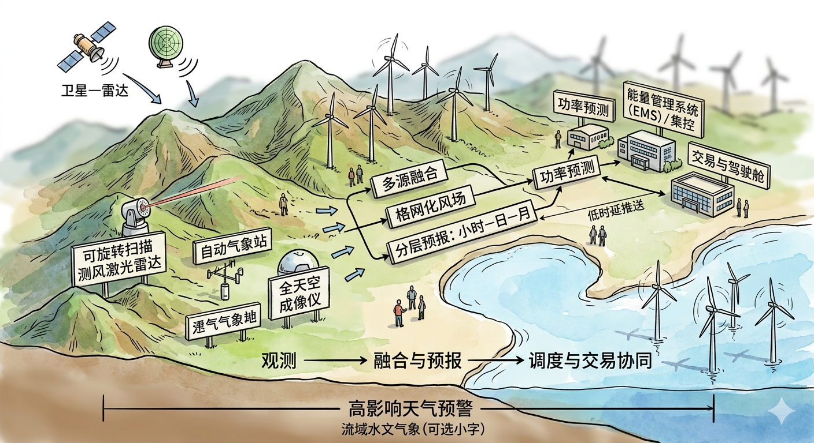
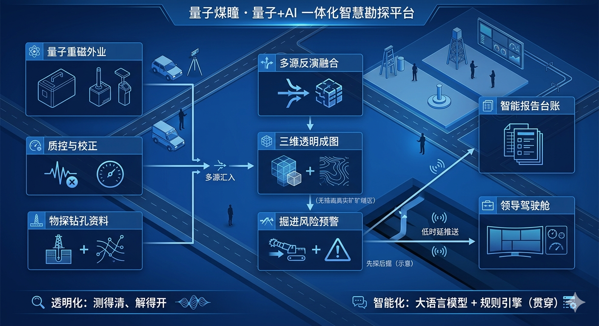
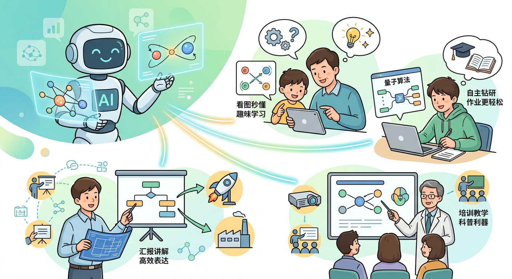
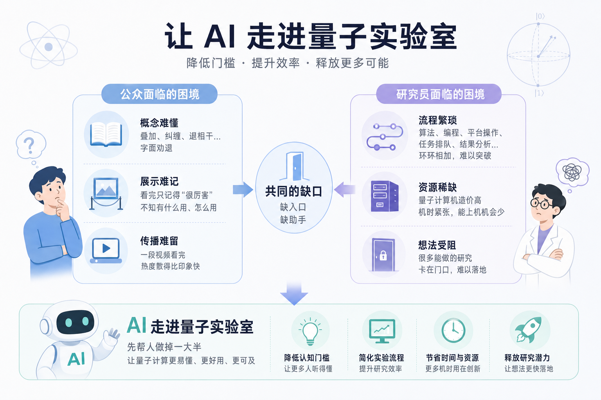

# 用得上的绘图Prompts

## 等距视角沙盘图绘制

Prompts：

> 等距三维手绘能源气象沙盘，水彩墨线、浅景深，山地—近海风电场与风机剪影；画面内可出现简体中文介绍性文字，须准确无误：左侧为「可旋转扫描测风激光雷达」「自动气象站」「全天空成像仪」及汇入的「卫星—雷达」示意；中部为「多源融合」「格网化风场」「分层预报：小时—日—月」三块标牌或信息条相连；右侧为「功率预测」「能量管理系统（EMS）／集控」「交易与驾驶舱」与细箭头标注的「低时延推送」；底部一条辅线写「高影响天气预警」「流域水文气象（可选小字）」。整体串联「观测 → 融合与预报 → 调度与交易协同」，人物仅作比例，勿添加未列出的指标、数字或口号。

Image：

Model：Google Gemini - Nano Banana 2

---

Prompts:

> 等距三维能源/工业虚拟现实风格，数字孪生场景，丰富的色彩，蓝色主题，科技感风格，全息投影感觉，硬朗线条，浅景深；山西煤矿地表场景：道路、工业广场、井口、储装运轮廓即可，不绘制地下地层剖面、不做地质体剖切、不出现半开岩层或“切开地球”的断面。以平面布局 + 等距小模块为主，可用人眼高度的透视，但保持地表完整，不展示井下剖面。

> 画面内所有要点、阶段标牌均须**图文并列**：每块主文案左侧或上方配**独立扁平图标**（同一块内的图标风格统一、线宽一致；图标与文字一一对应，不可空牌）。

> **左侧（外业与汇入）**  

- 「量子重磁外业」：配**量子重力仪、量子磁力计**两类设备的简化侧视/等距**设备外形示意**（科研仪器感，不标注型号、不写技术参数、不写英文缩写小字，可极淡写 “重力 / 磁力” 以区分）。可加小型车载或便携三脚架/手持示意其一，表示可进场作业。  
- 「质控与校正」：配**质控/滤波/去伪**类图标（如带剔除符号的波形或校准刻度盘抽象图形），勿画具体软件界面。  
- 「物探钻孔资料」：配**钻机/钻孔**简图 + **物探线/检波点**等抽象示意**组合图标**（表示历史与多源数据汇入），不写具体物探方法英文缩写。  
- 自「物探钻孔资料」与经质控后的外业流，**细箭头**汇向中部，小字可写「多源汇入」小标签（同样带小汇聚箭头图标）。

> **中部（反演、成图、识别、预警，自上而下或自左而右一条主链）**  

- 「多源反演融合」：配**多路箭头汇入立方体/数据块**的融合图标。  
- 「三维透明成图」：配**体素网格/透明体块+等高线/栅格**的“统一底图”抽象图标（不画真实矿井巷道剖面图）。  
- 「掘进风险预警」：配**掘进机/隧道进尺方向箭头 + 警示三角**的简化组合图标，旁可极小字写「先探后掘（示意）」。  

> **右侧（管理交付，双出）**  

- 「智能报告台账」：配**叠放文档/表格/勾选清单**的图标。  
- 「领导驾驶舱」：配**宽屏/多块拼接大屏 + 简仪表盘/曲线**的图标，表示一屏可览。  
- 自「掘进风险预警」引出**两枚分岔细箭头**分别连到上述两块，可沿箭头加**低时延推送**的脉冲/小无线电波纹图标（小字、非口号）。

> **角标 / 题签**（须配小图标：量子相关科技符号，勿用真实公司商标）  

- 主标题条：「量子煤瞳 · 量子+AI 一体化智慧勘探平台」。

> **底部辅线**（每条短语旁配**微型图标**）  

- 「透明化：测得清、解得开」：小放大镜+波纹场线。  
- 「智能化：大语言模型 + 规则引擎（贯穿）」：小对话泡+齿轮/规则列表抽象图标。  

> 整体主叙事串联为：「外业与质控、资料汇入 → 多源反演与成图 → 致灾体与掘进预警 → 报告与领导驾驶舱」；可有人物剪影仅作比例，不占画面中心。不要添加未在本文出现的指标、数字、经济口号、口号式标语、或与文档冲突的新名词；所有中文须与上述**完全一致、无错字**。

Image:

Model：Google Gemini - Nano Banana 2

---

Prompts:

> 根据以下资料，生成一个用于简单表达场景和流程的参考示意图，用于作为微信公众号文章的插图。

> 要求使用轻松易读的商业剪贴画风格，使用中文，文字量较少，字符准确，轮廓清晰

> 不要添加标题和小标题，不要刻板地显示相关文字，要有自己的理解和思考

> 不要显示任何与单位名称相关的文本

> 不要在图片上方和下方显示横条

> # 量子计算不难学！国光量子让 AI 变身科普小能手

> 量子计算可谓是今年最火的话题了，火到朋友圈里经常会出现相关的新闻，大家也喜欢在留言区讨论几句；可真要往下讲，量子叠加是什么、算法厉害在哪里，话题往往停在“好像很厉害”这一层。不是大家不聪明，而是这类知识天然带着门槛：名词多、直觉少，光靠脑补很容易把自己绕晕。另一边，做课题、做展示、做项目汇报的人更头疼——知道的东西写不满一页 PPT，想讲得生动，又缺少趁手的表达工具。

> 国光量子最近把这件事当成了一个问题来解：做一套“面向量子计算的 AI 科普工具”，让难讲的东西，可以用更像人话的方式聊出来；让抽象的东西，可以边看边点、边玩边懂。下面我们从四个角度，把这个工具在解决什么、给谁用、靠什么技术撑起来、用起来是什么体验，尽量说清楚。

> ## 先聊三件“烦心事”

> 第一件，是大众认知的“知其然不知其所以然”。展厅里的展板、短视频里的口播，常常把结论讲得很漂亮，可一旦追问“它到底解决了哪一类问题”“和我的生活有什么关系”，很多人仍会感到空白。科普如果停在口号层，热度就很难沉淀成理解。

> 第二件，是学习曲线的陡峭。量子计算并不是只背概念就够：既要建立直觉，又要在不同表述之间对齐口径。没有老师随时在旁答疑、没有可反复操作的抓手，读者很容易在“听懂一句话”和“自己讲清楚一段话”之间卡住。

> 第三件，是表达与汇报的受限。学生要做读书报告，工程师要给跨部门同事解释，科研团队要把进展向非专业听众讲明白——这类场合不需要证明定理，但需要准确、干净、可分享的材料。过去要么自己画图写页，要么把长文压缩成几句干话，既耗时又容易泄气。

> 这套科普工具想做的，就是把这三件事拆开对症处理：补上理解的入口、降低自学的消耗、顺带把“能讲给别人听”这件事变得轻松一些。

> ## 谁会喜欢用得上

> 工具的用法可以很轻，但背后的人群并不单一。

> 带孩子逛科技馆的家长、对前沿话题好奇的普通读者，往往只需要一条清晰主线、几张能停留注意力的画面，以及随时可追问的问答。工具用对话承接问题，用图示接住注意力，让人不至于“看完就忘”。

> 高校里修课、做交叉项目的学生，更在意知识是否能在作业和讨论里落地。工具既可以是预习器，也可以是小抄级助教：哪里不懂就问哪里，问完还能继续往下走。

> 从事工程与应用研究的伙伴，常常需要在产品宣讲、技术路演里把量子相关段落讲清楚。对他们而言，这套工具更像“表达外骨骼”：把复杂叙事拆成可展示的段落，再配套可视化，省去大量重复劳动。

> 面向科研与教学场景的使用者，也可以把它当作对外科普与对内培训的底座：同一套内容，既能讲给来访人员听，也能裁剪成课堂辅助材料，减少“同一个故事讲五遍”的疲惫感。

Image:

Model：Google Gemini - Nano Banana 2

---

Prompts:

> 根据以下文字，描绘一张简单的结构图，使用清淡配色、时尚风格，用于文章配图，适合微信公众号阅读。要求使用轻松易读的商业剪贴画风格，使用中文，文字量较少，字符准确，轮廓清晰

> 简单添加与人物、场景相关的剪贴画，不要刻板地采用方块作为划分，增强图片的整体感。

> 不要添加标题和小标题，不要刻板地显示相关文字，要有自己的理解和思考

> 不要显示任何与单位名称相关的文本

> 不要在图片上方和下方显示横条

> 图片整体以描述概念为主，补充简单的剪贴画，画面无任何油腻感和涂抹痕迹。

> 参考内容：
大语言模型在科研写作辅助中已经较为常见，例如解释摘要要点、改写句式、生成提纲草案等，通常能节省时间。但若把目标设定为「单次对话直接输出一篇可提交的综述」，则需要格外谨慎。

> 通用对话形态的大模型在缺乏明确约束时，可能弱化或省略检索与筛选过程，使读者难以判断结论所依据的文献范围与选择标准；不同论文对同一概念或同一类实验条件的表述也可能存在差异，若模型在生成文本时对来源信息整合过度「平滑」，便容易出现术语口径漂移或与原文不完全一致的情况。此类问题在短文本问答中未必突出，但在综述这类长文本、强引用场景下，人工核对成本会显著上升。业界常将大语言模型在语法通顺、语气自信的前提下仍输出与可核对事实不一致的现象称为「幻觉」（hallucination），典型表现包括虚构不存在的论文或作者、将不同文献的结论张冠李戴、给出看似具体却无法溯源的实验数据或版本信息，以及在缺少依据时补全看似合理实则错误的细节；其性质主要是概率性语言生成在缺少外部约束与核验机制时的系统性风险，并不等同于「故意造假」。在综述写作中，上述风险会直接牵动学术诚信与可复核性，因而不能仅凭「读起来像」来判定文本是否可用。

> 再者，综述写作通常包含多个相对独立的子任务：扩展检索、去重与聚类、引用网络或主题结构的把握、分篇提要、术语表维护、提纲编排、初稿撰写与多轮校订等。若全部压缩在单次问答中完成，作者既难追踪每一步的输入输出，也不利于在审稿或团队讨论中复盘与修订。

Image:

Model：Google Gemini - Nano Banana 2

---

Prompts:

> 根据以下文字，描绘一张简单的结构图，使用清淡配色、时尚风格，用于文章配图，适合微信公众号阅读。必须提炼文字的主题和概要，图中不得使用大量的文字，体现主要内容即可。文字必须清晰可见，文本没有任何错误，使用苹方字体，字体轮廓明显，图片整体以文字为主，补充简单的剪贴画，画面无任何涂抹痕迹。
参考内容：量子计算这两年总是频繁出现在公众视野里。每次有新成果发布，热搜上都能看到它的影子。可热度归热度，真想往里走一步，大多数人都会被挡在门外。

> 对一般读者来说，叠加、纠缠、退相干这些词，光是字面就够劝退。展厅里的图文展示也帮不上太多忙——看完只记得"很厉害"，至于厉害在哪、怎么用、和自己有什么关系，还是模模糊糊。一段视频看完，热度散得比留下的印象还快。

> 对研究员来说，门槛在另一个地方。一次实验要把算法、编程、平台操作、任务排队、结果分析挨个走一遍，每一段都不算难，加在一起就够把许多有想法的人卡住。再加上量子计算机本身造价不低、机时紧张，能真正坐到机器前的人很少。很多原本完全可以做出来的研究，就这样卡在了门口。

> 公众这边缺一个听得懂的入口，研究这边缺一个跑得通的助手。两件事看着无关，其实指向同一种解法——让 AI 走进量子实验室，把过去需要经验、耐心、长时间训练才能完成的事情，先帮人做掉一大半。

Image:

Model: GPT Image 2